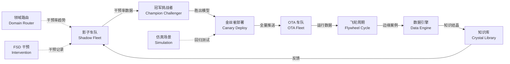

# 进化引擎前端实现拓扑

## 一、模块架构拓扑

```mermaid
graph TB
    subgraph 导航层
        NAV[侧边栏 - 进化引擎]
    end

    subgraph 页面层["页面层（10 个页面）"]
        DASH[进化总览仪表盘<br/>EvolutionDashboard]
        SHADOW[影子车队监控<br/>ShadowFleetPanel]
        CHAMP[冠军挑战者管理<br/>ChampionChallengerPanel]
        CANARY[金丝雀部署控制台<br/>CanaryDeployConsole]
        OTA[OTA 车队管理<br/>OTAFleetManager]
        FLY[飞轮周期报告<br/>FlywheelCycleReport]
        DOMAIN[领域路由配置<br/>DomainRouterConfig]
        FSD[FSD 干预分析<br/>FSDInterventionView]
        SIM[仿真场景管理<br/>SimulationManager]
        CRYSTAL[知识结晶库<br/>KnowledgeCrystalLib]
    end

    subgraph 数据层["数据层（tRPC 调用）"]
        API_SHADOW[evoEvolution.shadowEval.*]
        API_CHAMP[evoEvolution.championChallenger.*]
        API_CANARY[evoEvolution.canary.*]
        API_DATA[evoEvolution.dataEngine.*]
        API_CYCLE[evoEvolution.cycle.*]
        API_CRYSTAL[evoEvolution.crystal.*]
        API_FSD[evoEvolution.fsd.*]
        API_SCHED[evoEvolution.schedule.*]
        API_OVER[evoEvolution.getOverview]
        API_FLY[evoEvolution.getFlywheelStatus]
    end

    NAV --> DASH
    NAV --> SHADOW
    NAV --> CHAMP
    NAV --> CANARY
    NAV --> OTA
    NAV --> FLY
    NAV --> DOMAIN
    NAV --> FSD
    NAV --> SIM
    NAV --> CRYSTAL

    DASH --> API_OVER
    DASH --> API_FLY
    DASH --> API_CYCLE
    SHADOW --> API_SHADOW
    SHADOW --> API_FSD
    CHAMP --> API_CHAMP
    CANARY --> API_CANARY
    OTA --> API_CANARY
    FLY --> API_CYCLE
    FLY --> API_SCHED
    DOMAIN --> API_FSD
    FSD --> API_FSD
    SIM --> API_FSD
    CRYSTAL --> API_CRYSTAL
```



## 二、进化闭环数据流拓扑



## 三、页面规划详情

| # | 页面 | 路由 | 对接 API | 核心功能 |
|---|------|------|----------|----------|
| 1 | 进化总览仪表盘 | `/evolution/dashboard` | getOverview, getFlywheelStatus, cycle.getTrend | 全局指标卡片 + 趋势图 + 闭环状态环 |
| 2 | 影子车队监控 | `/evolution/shadow` | shadowEval.list/create/start/get | 影子评估实验列表 + 创建 + 详情 + 指标对比 |
| 3 | 冠军挑战者管理 | `/evolution/champion` | championChallenger.list/create/verdict/get | 实验列表 + 创建 + 手动裁决 + 详情 |
| 4 | 金丝雀部署控制台 | `/evolution/canary` | canary.list/create/get/rollback/promote | 部署列表 + 阶段推进 + 健康检查 + 回滚/提升 |
| 5 | OTA 车队管理 | `/evolution/ota` | canary.list + fsd.getInterventionRate | OTA 部署状态 + 车队健康 + 分阶段回滚 |
| 6 | 飞轮周期报告 | `/evolution/flywheel` | cycle.list/getTrend/getStepLogs, schedule.* | 周期历史 + 趋势图 + 步骤日志 + 调度配置 |
| 7 | 领域路由配置 | `/evolution/domain-router` | fsd.getInterventionRate/listInterventions | 干预率仪表盘 + 趋势分析 + 路由规则 |
| 8 | FSD 干预分析 | `/evolution/fsd` | fsd.listInterventions/getIntervention | 干预记录列表 + 详情 + 视频轨迹 |
| 9 | 仿真场景管理 | `/evolution/simulations` | fsd.listSimulations/getSimulation | 场景列表 + 详情 + 难度分布 |
| 10 | 知识结晶库 | `/evolution/crystals` | crystal.list/get/verify | 结晶列表 + 详情 + 验证操作 |

## 四、导航结构

```
进化引擎 🔄
├── 进化总览          /evolution/dashboard
├── 影子评估          /evolution/shadow
├── 冠军挑战者        /evolution/champion
├── 金丝雀部署        /evolution/canary
├── OTA 车队          /evolution/ota
├── 飞轮周期          /evolution/flywheel
├── 领域路由          /evolution/domain-router
├── FSD 干预          /evolution/fsd
├── 仿真场景          /evolution/simulations
└── 知识结晶          /evolution/crystals
```

## 五、共享组件

| 组件 | 用途 | 使用页面 |
|------|------|----------|
| StatusBadge | 状态标签（active/completed/failed/rolled_back） | 全部 |
| MetricCard | 指标卡片（数值 + 趋势箭头） | Dashboard, Shadow, Flywheel |
| TrendChart | 趋势折线图（Recharts） | Dashboard, Flywheel, Domain Router |
| StageTimeline | 阶段时间线（金丝雀/OTA 部署阶段） | Canary, OTA |
| HealthCheckTable | 健康检查记录表格 | Canary, OTA |
| CreateDialog | 通用创建对话框 | Shadow, Champion, Canary, Schedule |
| ConfirmDialog | 确认操作对话框（回滚/提升/裁决） | Canary, Champion |
