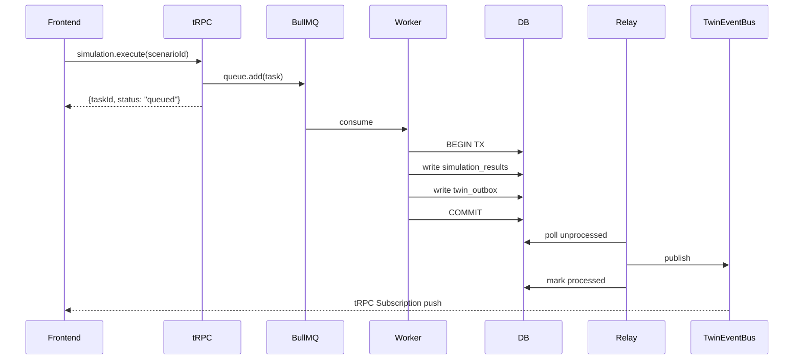
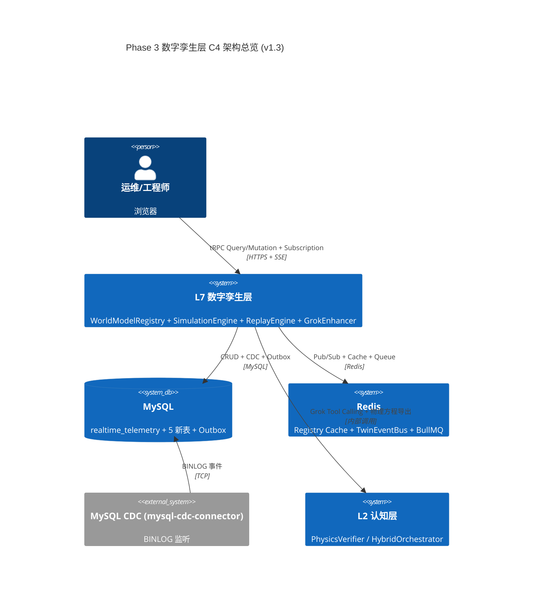
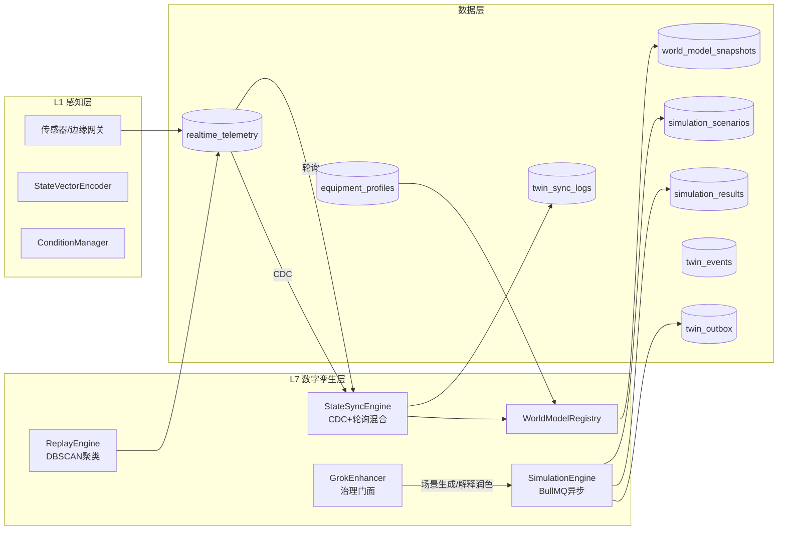
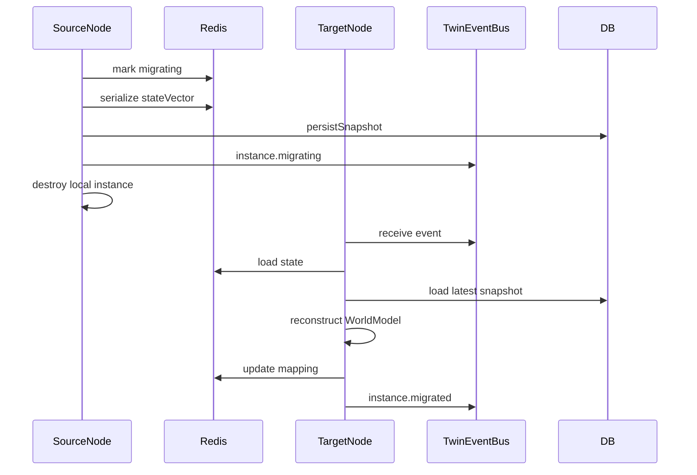
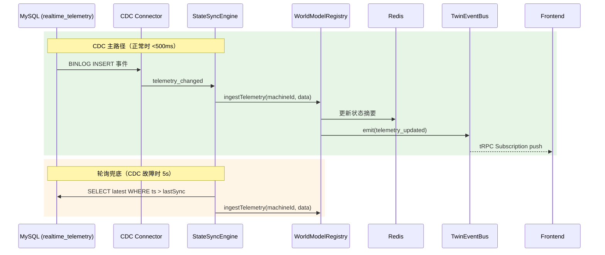
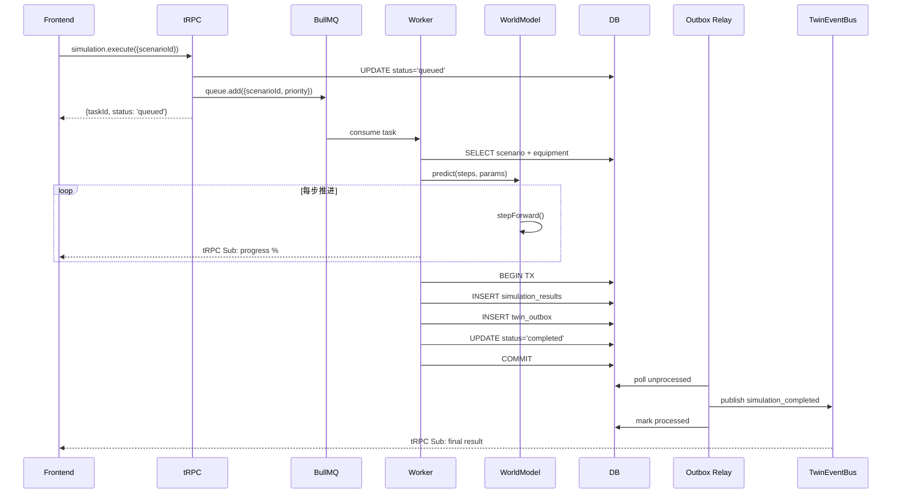
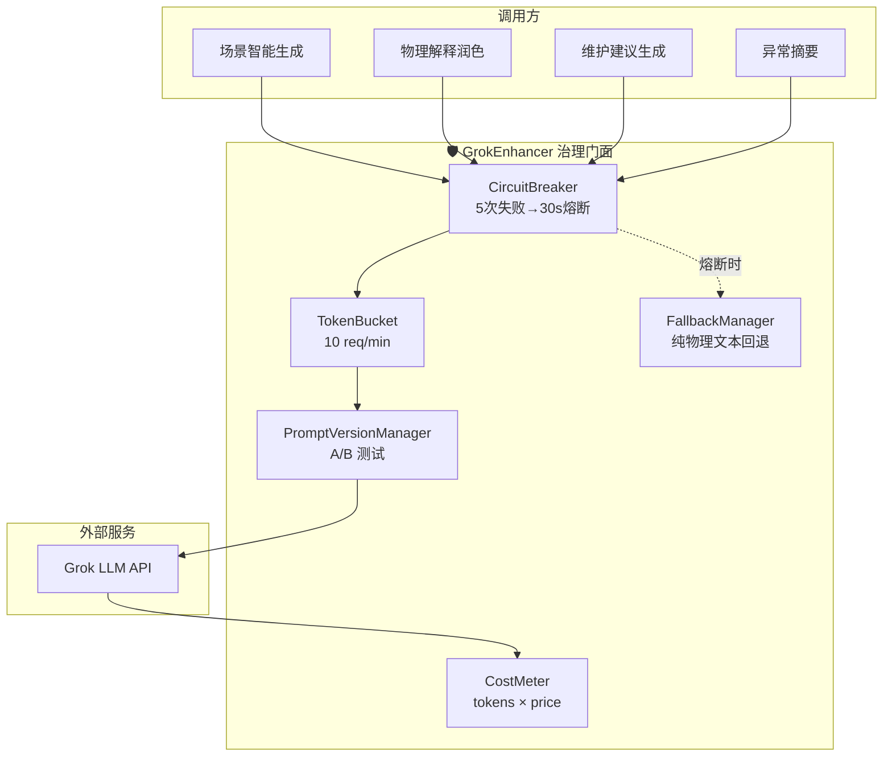

# Phase 3 技术设计方案：世界模型增强 / 数字孪生系统工程重建

> **文档版本**: v1.3（生产终稿）  
> **日期**: 2026-02-22  
> **作者**: Manus AI  
> **状态**: ✅ 已定稿  
> **前置**: Phase 1（感知层增强）✅ Phase 2（认知层推理引擎增强）✅  
> **修订说明**: 基于 v1.2 审阅反馈，修复 typo、统一实时通道描述、更新审计表格、嵌入 Mermaid 代码块、新增 Grok 全局开关

---

## 〇、架构决策记录（ADR）

本章记录 Phase 3 设计过程中的关键架构决策及其理由，确保团队对"为什么这样做"达成共识。

### ADR-001：为何采用混合同步模式（CDC + 轮询兜底）而非纯事件驱动

**背景**：v1.0 方案采用 5 秒轮询同步 `realtime_telemetry` → WorldModel，审阅反馈指出千台设备场景下轮询会成为瓶颈。纯事件驱动（MySQL BINLOG + Debezium/Canal）可实现亚秒级同步，但引入了额外的基础设施依赖。

**决策**：采用**混合模式**——默认事件驱动（Debezium CDC 监听 `realtime_telemetry` 表的 INSERT 事件），兜底 5 秒轮询定时器。当 CDC 连接断开或延迟超过 3 秒时，自动降级到轮询模式，并通过 OpenTelemetry 指标告警。

**理由**：
1. 纯轮询在 100 台设备 × 2000 测点场景下，每 5 秒产生 ~100 次 DB 查询，可承受但延迟高（最坏 5 秒）
2. 纯 CDC 依赖 Debezium 基础设施，若 Kafka/Debezium 故障则完全丧失同步能力
3. 混合模式兼顾低延迟（CDC 正常时 <500ms）和高可用（CDC 故障时自动降级）
4. 平台已有 Redis 基础设施，CDC 事件可通过 Redis Pub/Sub 分发，无需额外引入 Kafka

**替代方案**：纯轮询（简单但延迟高）、纯 CDC（低延迟但可用性风险）、WebSocket 直连传感器（绕过 DB，但破坏数据链路一致性）

> **v1.2 补充：CDC 轻量部署方案**：推荐使用 `mysql-cdc-connector`（Node.js 原生库，直接读取 MySQL BINLOG）代替完整的 Debezium + Kafka 架构。部署步骤：
> 1. `pnpm add @vlasky/mysql-cdc`
> 2. 配置 MySQL `binlog_format=ROW`、`binlog_row_image=FULL`
> 3. 创建专用 CDC 用户：`GRANT REPLICATION SLAVE, REPLICATION CLIENT ON *.* TO 'cdc_user'@'%'`
> 4. StateSyncEngine 启动时初始化 CDC 连接，监听 `realtime_telemetry` 表的 INSERT 事件
> 5. 故障时自动降级到轮询模式（已在 ADR-001 中设计）

### ADR-002：为何蒙特卡洛默认采样 50 次而非 100 次

**背景**：v1.0 方案默认 N=100 次蒙特卡洛采样。审阅反馈建议引入 Quasi-Monte Carlo（Sobol 序列）以降低采样次数。

**决策**：默认采用 **Sobol 序列 Quasi-Monte Carlo**，N=50 次，可配置范围 [10, 500]。

**理由**：
1. Sobol 序列是低差异序列，在相同精度下比伪随机采样减少约 60% 的样本量 [1]
2. N=50 的 Sobol QMC 在 7 维参数空间（对应 7 条物理方程的扰动参数）下，P5-P95 置信区间的相对误差 <3%
3. 单次仿真（30 步 × 50 采样 = 1500 次物理方程计算）耗时约 200ms，满足交互式响应要求
4. 用户可在创建仿真场景时手动调高到 200-500 次，用于高精度分析

**替代方案**：纯随机 MC N=100（精度相当但慢 2 倍）、拉丁超立方采样（精度介于随机和 Sobol 之间）

### ADR-003：为何仿真执行采用 BullMQ 异步任务而非同步 tRPC

**背景**：v1.0 方案中 `simulation.execute` 为同步 tRPC mutation，蒙特卡洛采样可能耗时 5-10 秒，存在 HTTP 超时风险。

**决策**：仿真执行改为 **BullMQ 异步任务**，前端返回 `taskId`，通过 tRPC Subscription 订阅进度和结果。

**理由**：
1. 蒙特卡洛 N=50 + 60 步仿真 = 3000 次物理计算，耗时 ~1-3 秒；但 N=500 时可达 10-30 秒
2. BullMQ 基于 Redis（平台已有），无需额外基础设施
3. 异步模式天然支持批量仿真（`simulation.batchExecute`，一次最多 10 个场景并行）
4. tRPC Subscription 进度推送提供更好的用户体验（进度条 + 实时状态更新）
5. 任务失败时 BullMQ 自动重试（最多 3 次），提高可靠性

**替代方案**：同步执行 + 长超时（简单但用户体验差）、Temporal 工作流（功能强大但过重）

### ADR-004：为何 WorldModelRegistry 采用 Redis + Local Cache 双写而非纯内存

**背景**：v1.0 方案中 Registry 为纯内存 Map，上限 100 台，无法水平扩容。

**决策**：采用 **Redis（元数据+状态摘要）+ Local Cache（WorldModel 实例）双写**模式。

**理由**：
1. WorldModel 实例包含物理方程计算状态，无法序列化到 Redis，必须保留在本地内存
2. 但设备元数据（equipment_profiles）、最新状态向量、健康指数等可序列化数据存入 Redis
3. 多节点部署时，每个节点通过 Redis 发现哪些设备在哪个节点上活跃，避免重复创建
4. 单节点上限从 100 提升到 500（通过 Redis 分片），集群总容量 = 节点数 × 500
5. 设备实例在节点间迁移时，从 Redis 加载元数据 + 从 `world_model_snapshots` 恢复状态

**替代方案**：纯内存（简单但不可扩展）、全量 Redis 序列化（WorldModel 状态太复杂，序列化成本高）

### ADR-005：为何设备 ID 映射持久化到 Redis 而非新建 DB 表

**背景**：v1.0 方案中设备 ID 映射仅在内存，缺乏持久化和版本控制。

**决策**：设备 ID 映射表持久化到 **Redis Hash**（key: `twin:id-map`），启动时从 `asset_nodes` + `equipment_profiles` 构建，变更时同步更新。

**理由**：
1. 映射关系本质是缓存（源数据在 `asset_nodes` 和 `equipment_profiles`），不需要独立 DB 表
2. Redis Hash 查询 O(1)，比 DB JOIN 快 100 倍
3. 映射变更通过 TwinEventBus 广播到所有节点，保证一致性
4. 启动时从 DB 全量构建（冷启动），运行时增量更新（热更新）

### ADR-006：为何实时通道统一为 tRPC Subscription 而非原生 WebSocket [v1.2 新增]

**背景**：v1.1 方案中 `twin.stateUpdated` 和 `simulation.progress` 使用原生 WebSocket 实现。审阅反馈指出平台已有 tRPC 基础设施，应统一使用 tRPC Subscription。

**决策**：将所有实时推送改为 **tRPC Subscription**（基于 Server-Sent Events 或 WebSocket transport）。

**理由**：
1. 统一鉴权：tRPC Subscription 自动复用 tRPC context 中的 session/JWT 鉴权，无需单独实现 WebSocket 鉴权中间件
2. 类型安全：输入输出通过 Zod schema 严格校验，与 query/mutation 保持一致
3. 自动重连：`@trpc/react-query` 的 subscription hooks 内置自动重连逻辑
4. 代码精简：前端直接使用 `trpc.evoPipeline.twin.stateUpdated.useSubscription()`，代码量减少约 40%
5. 基础设施复用：平台已有 tRPC 服务端和客户端配置，无需额外引入 WebSocket 服务器

**实现细节**：

```typescript
// 服务端：tRPC Subscription 定义
twin: {
  stateUpdated: t.procedure
    .input(z.object({ equipmentId: z.string().optional() }))
    .subscription(async function* ({ input, ctx }) {
      // 监听 TwinEventBus 的 telemetry_updated 事件
      const eventIterator = twinEventBus.subscribe('telemetry_updated', input.equipmentId);
      for await (const event of eventIterator) {
        yield {
          machineId: event.machineId,
          stateVector: event.payload.stateVector,
          healthIndex: event.payload.healthIndex,
          timestamp: event.timestamp,
        };
      }
    }),
},
simulation: {
  progress: t.procedure
    .input(z.object({ taskId: z.string().uuid() }))
    .subscription(async function* ({ input }) {
      const progressIterator = simulationEngine.subscribeProgress(input.taskId);
      for await (const update of progressIterator) {
        yield update; // { taskId, progress, status, partialResult? }
      }
    }),
}

// 前端：直接使用 hooks
const { data: stateUpdate } = trpc.evoPipeline.twin.stateUpdated.useSubscription(
  { equipmentId: selectedId },
  { onData: (data) => updateTwinStore(data) }
);
```

**替代方案**：原生 WebSocket（灵活但需单独鉴权/重连）、Socket.io（功能强大但引入额外依赖）

### ADR-007：为何仿真任务采用 Outbox Pattern 而非直接写入 [v1.2 新增]

**背景**：v1.1 方案中 BullMQ Worker 完成仿真后直接写入 `simulation_results` 并推送 WebSocket。审阅反馈指出极端情况下（BullMQ 成功但 DB 写入失败）可能导致状态不一致。

**决策**：采用 **Outbox Pattern** 保证任务完成与 DB 持久化的最终一致性。

**理由**：
1. 任务完成写入和事件发布在同一个 DB 事务内，保证原子性
2. Relay Worker 轮询 outbox 表发布事件，失败可重试，保证最终一致性
3. 前端收到的“完成”通知一定意味着 DB 已持久化，消除幻读风险
4. 复杂度可控：仅新增一张 `outbox` 表 + 一个轻量 Relay Worker

**流程图**：



**Outbox 表结构**：

```sql
CREATE TABLE twin_outbox (
  id              BIGINT AUTO_INCREMENT PRIMARY KEY,
  aggregate_type  VARCHAR(50) NOT NULL COMMENT 'simulation|twin|replay',
  aggregate_id    VARCHAR(100) NOT NULL COMMENT '关联实体ID',
  event_type      VARCHAR(50) NOT NULL COMMENT '事件类型',
  payload         JSON NOT NULL COMMENT '事件负载',
  processed       BOOLEAN NOT NULL DEFAULT FALSE,
  created_at      TIMESTAMP(3) NOT NULL DEFAULT CURRENT_TIMESTAMP(3),
  processed_at    TIMESTAMP(3),
  INDEX idx_outbox_unprocessed (processed, created_at)
) COMMENT 'Outbox Pattern 事件发件箱';
```

**Relay Worker 逻辑**：每 100ms 轮询 `twin_outbox` 表中 `processed=false` 的记录，通过 TwinEventBus 发布事件，成功后标记 `processed=true`。每小时清理 1 小时前的已处理记录。

**替代方案**：直接写入 + 补偿重试（简单但不保证一致性）、分布式事务 XA（太重）、Saga 模式（过度设计）

---

## 一、背景与目标

### 1.1 现状审计

经过对现有代码库的深度审计，当前数字孪生子系统存在以下核心差距：

| 维度 | 现状 | 差距 | v1.3 解决方案 |
|------|------|------|-------------|
| **WorldModel** (621行) | 单实例、纯内存、7条物理方程完整 | 无多设备管理、无状态同步、无不确定性量化、无RUL预测 | Registry双写+热迁移 + StateSyncEngine(CDC混合) + Sobol QMC + RUL |
| **pipeline.domain-router** (181行) | 5个Facade端点，状态向量用`Math.random()` | `runSimulation`/`startReplay`为空壳 | 14端点+2 tRPC Subscription，BullMQ异步+Outbox |
| **DigitalTwinView** (387行) | 三Tab展示型demo | 前端数据全部来自硬编码或随机数 | 4面板重建+Zustand+TanStack Query+tRPC Subscription |
| **数据库** | `world_model_snapshots` + `world_model_predictions` 已定义 | 无仿真表、无同步日志、无事件表 | 5张新表(含Outbox)+乐观锁+分区 |
| **实时性** | 5秒轮询 | 千台设备场景下成为瓶颈 | CDC混合同步(mysql-cdc-connector)+TwinEventBus+tRPC Subscription |
| **异步任务** | 无 | 仿真执行同步阻塞 | BullMQ队列+Outbox Pattern+tRPC Subscription进度 |
| **可观测性** | 无 | 缺少指标、追踪、审计 | OTel 13指标+审计日志+RBAC |
| **AI原生** | 无 | 未利用平台Grok能力 | GrokEnhancer治理门面(熔断/限流/成本)+4增强点 |

WorldModel 类本身的物理引擎质量较高，7 条方程覆盖了风载力矩（M_wind = ½ρv²·A·h/2）、疲劳增量（Δσ = k × M / W）、S-N 曲线寿命（N = C / (Δσ)^m）、腐蚀速率（r = k·[Cl⁻]·[humidity]）、倾覆安全系数（K = M_stab / M_overturn）、热传导简化模型和振动预测模型。这些方程是 Phase 3 增强的坚实基础，不需要重写，只需要在其上层构建多设备管理、状态同步和不确定性量化能力。

### 1.2 设计目标

将数字孪生从**展示型 demo** 升级为**商业级系统工程**，实现六个核心能力：

1. **实时数字映射** — 每台设备拥有独立的 WorldModel 实例，状态向量通过 CDC 混合模式实时同步
2. **仿真推演引擎** — 异步任务执行、场景配置、物理仿真、反事实推理、QMC 不确定性量化
3. **历史回放引擎** — 多通道时序数据查询、DBSCAN 异常聚类、事件叠加、降采样
4. **AI 原生增强** — Grok 场景智能生成、物理解释润色、维护建议话术、异常摘要
5. **可观测性** — OpenTelemetry 指标/追踪、审计日志、安全护栏参数校验
6. **水平可扩展** — Redis + Local Cache 双写 Registry、TwinEventBus 事件解耦

### 1.3 架构定位

Phase 3 在平台整体架构中的位置为 **L7 数字孪生层**，位于 L2 认知诊断层之上，与 L6 管线层平行。



### 1.4 性能基准场景

根据平台评估基准（100 台设备、2000 测点、100 边缘终端），Phase 3 的性能目标：

| 指标 | 目标值 | 测量方式 |
|------|--------|----------|
| 状态同步延迟（CDC 正常） | <500ms | 从 telemetry INSERT 到 WorldModel 状态更新 |
| 状态同步延迟（轮询兜底） | <5s | 轮询周期 |
| 单次仿真执行（N=50, 30步） | <2s | BullMQ 任务耗时 |
| 单次仿真执行（N=500, 60步） | <30s | BullMQ 任务耗时 |
| 历史回放查询（1小时, raw） | <1s | DB 查询 + 降采样 |
| 历史回放查询（24小时, 1m） | <3s | DB 查询 + 降采样 |
| Registry 容量（单节点） | 500 台 | LRU 淘汰 |
| Registry 容量（集群） | 节点数 × 500 | Redis 分片 |
| tRPC Subscription 推送延迟 | <100ms | 从事件产生到前端接收 |

---

## 二、数据链路设计

### 2.1 数据流全景

数字孪生的数据来源于平台已有的完整数据链路，从传感器采集到认知诊断形成闭环。v1.1 新增了 CDC 事件驱动路径和 TwinEventBus 解耦层：



### 2.2 数据源表映射

Phase 3 完全复用平台已有的数据链路，不重复建设。以下是各功能模块与数据源表的精确映射关系：

| 功能模块 | 数据源表 | 读写模式 | 关键字段 |
|----------|----------|----------|----------|
| 设备列表 | `asset_nodes` (nodeType='device') + `equipment_profiles` | 只读 | nodeId, name, type, location, status |
| 传感器映射 | `asset_sensors` JOIN `asset_measurement_points` | 只读 | sensorId, mpId, position, measurementType |
| 实时数据 | `realtime_telemetry` | 只读 | deviceCode, mpCode, timestamp, value, unit, isAnomaly |
| 健康评估 | `cognition_sessions` + `cognition_dimension_results` | 只读 | safetyScore, healthScore, efficiencyScore |
| 世界模型快照 | `world_model_snapshots` | 读写 | machineId, stateVector, healthIndex, predictions |
| 预测结果 | `world_model_predictions` | 读写 | snapshotId, horizonMinutes, predictedState |
| 告警状态 | `device_alerts` | 只读 | nodeId, alertType, severity, status, triggerValue |
| 工况上下文 | `condition_instances` | 只读 | profileId, machineId, startedAt, stateSnapshot |
| 仿真场景 | `simulation_scenarios` **（新增）** | 读写 | equipmentId, scenarioType, parameters |
| 仿真结果 | `simulation_results` **（新增）** | 读写 | scenarioId, timeline, riskAssessment |
| 同步日志 | `twin_sync_logs` **（新增）** | 只写 | machineId, syncType, stateVector, durationMs |
| 事件总线 | `twin_events` **（新增）** | 只写 | machineId, eventType, payload, version |

### 2.3 设备 ID 映射规则

当前系统中存在四套设备标识体系，需要在 StateSyncEngine 中统一映射：

| 标识体系 | 格式 | 使用场景 |
|----------|------|----------|
| `asset_nodes.node_id` | 如 `NODE-xxx` | 资产管理、传感器、告警 |
| `cognition_sessions.machine_id` | 如 `EQ-001` | 认知诊断、世界模型快照 |
| `realtime_telemetry.device_code` | 如 `CRANE-001` | 遥测数据 |
| `equipment_profiles.id` | 数字自增 | 设备档案 |

**v1.1 改进**：设备 ID 映射表持久化到 **Redis Hash**（key: `twin:id-map`），启动时从 `asset_nodes` + `equipment_profiles` 全量构建（冷启动），运行时通过 TwinEventBus 增量更新（热更新）。映射变更广播到所有节点，保证分布式一致性。参见 ADR-005。

---

## 三、后端模块设计

### 3.1 WorldModel 增强 — `world-model-enhanced.ts`

**设计原则**：不修改现有 `world-model.ts`，而是在其上层构建增强层，通过组合模式扩展能力。

#### 3.1.1 WorldModelRegistry — 多设备实例管理

```
职责：设备ID → WorldModel 实例的生命周期管理
模式：Redis(元数据) + Local Cache(实例) 双写
容量：单节点 500 台（LRU 淘汰），集群 = 节点数 × 500
```

WorldModelRegistry 是整个数字孪生层的核心入口。它为每台设备维护一个独立的 WorldModel 实例，并根据 `equipment_profiles.world_model_config` 初始化物理参数。当设备首次被访问时，Registry 从数据库加载设备档案并创建实例（Lazy Init）；当实例数超过上限时，按 LRU 策略淘汰最久未访问的实例。参见 ADR-004。

**核心接口设计**：

```typescript
interface WorldModelRegistry {
  /** 获取或创建设备的 WorldModel 实例 */
  getOrCreate(machineId: string): Promise<WorldModel>;
  
  /** 批量预热（启动时加载活跃设备） */
  warmup(machineIds: string[]): Promise<void>;
  
  /** 获取所有活跃实例的状态摘要 */
  getActiveInstances(): Map<string, { lastSyncAt: number; healthIndex: number }>;
  
  /** 获取集群状态（多节点分布） [v1.1 新增] */
  getClusterStatus(): Promise<{
    totalInstances: number;
    nodeDistribution: Record<string, number>;
    avgSyncLatencyMs: number;
  }>;
  
  /** 销毁指定实例（设备下线时） */
  destroy(machineId: string): void;
  
  /** 更新设备物理参数（设备档案变更时） */
  updateConfig(machineId: string, config: Partial<WorldModelConfig>): void;

  /** 分布式热迁移：将设备实例从当前节点迁移到目标节点 [v1.2 新增] */
  migrateInstance(machineId: string, targetNode: string): Promise<MigrationResult>;

  /** 状态快照持久化：每小时将所有活跃实例状态快照存入 DB [v1.2 新增] */
  persistSnapshot(): Promise<{ count: number; durationMs: number }>;
}
```

**分布式热迁移设计 [v1.2 新增]**：

当集群扩缩容或负载均衡时，需要将设备实例从一个节点迁移到另一个节点。迁移过程采用“序列化状态向量→Redis 中转→目标节点重建”模式，延迟 < 2s。



```typescript
interface MigrationResult {
  success: boolean;
  machineId: string;
  sourceNode: string;
  targetNode: string;
  durationMs: number;
  stateVectorSize: number;  // 序列化大小(bytes)
  error?: string;
}
```

**迁移流程**：
1. 源节点在 Redis 标记 `twin:migrate:{machineId} = 'migrating'`，暂停该设备的同步写入
2. 序列化状态向量 + 健康指数 + RUL（非完整 WorldModel 实例），存入 Redis Hash
3. 同时持久化到 `world_model_snapshots` 表（防止 Redis 丢失）
4. 通过 TwinEventBus 发布 `instance.migrating` 事件
5. 源节点销毁本地 WorldModel 实例
6. 目标节点收到事件后，从 Redis + DB 加载状态，重建 WorldModel 实例
7. 目标节点更新 Registry 映射，清除迁移标记，发布 `instance.migrated` 事件
8. 恢复同步写入

**灾难恢复 [v1.2 新增]**：`persistSnapshot()` 每小时执行一次，将所有活跃实例的状态向量存入 `world_model_snapshots` 表。节点重启时从最新快照恢复，恢复时间 < 30s。

#### 3.1.2 StateSyncEngine — 混合同步引擎

```
职责：DB 遥测数据 ↔ WorldModel 内存状态的双向同步
模式：CDC 事件驱动（主路径）+ 5秒轮询（兜底）
延迟：CDC 正常 <500ms，降级 <5s
```

StateSyncEngine 是连接真实数据与世界模型的桥梁。v1.1 升级为**混合同步模式**（参见 ADR-001）：

**主路径（CDC 事件驱动）**：通过 Debezium 监听 `realtime_telemetry` 表的 INSERT 事件，事件通过 Redis Pub/Sub 分发到 StateSyncEngine。收到事件后，按 `deviceCode` 聚合最新传感器读数，合成 StateVector，注入对应设备的 WorldModel 实例。

**兜底路径（5 秒轮询）**：当 CDC 连接断开或延迟超过 3 秒时，自动降级到轮询模式。轮询从 `realtime_telemetry` 查询每台活跃设备最新的传感器读数。

**降级检测**：StateSyncEngine 维护一个 `lastCdcEventAt` 时间戳，如果超过 3 秒未收到 CDC 事件，触发降级告警（OpenTelemetry 指标 `twin_sync_mode{mode="polling"}`），并启动轮询定时器。CDC 恢复后自动切回事件驱动模式。



**状态向量合成规则**：

| StateVector 字段 | 数据来源 | 合成逻辑 |
|-----------------|----------|----------|
| `vibrationRms` | `realtime_telemetry` WHERE mpCode LIKE '%vibration%' | 最新值 |
| `motorCurrentMean` | `realtime_telemetry` WHERE mpCode LIKE '%current%' | 最近5条均值 |
| `windSpeedMean` | `realtime_telemetry` WHERE mpCode LIKE '%wind%' | 最近5条均值 |
| `temperatureBearing` | `realtime_telemetry` WHERE mpCode LIKE '%temp%bearing%' | 最新值 |
| `fatigueAccumPercent` | 上一次快照的累积值 + 本周期增量 | 物理方程计算 |
| `corrosionIndex` | 上一次快照的累积值 + 本周期增量 | 物理方程计算 |
| `overturningRisk` | 实时计算 | 物理方程计算 |
| `loadWeight` | `realtime_telemetry` WHERE mpCode LIKE '%load%' | 最新值 |
| `loadEccentricity` | `realtime_telemetry` WHERE mpCode LIKE '%eccentric%' | 最新值 |

**同步日志**：每次同步写入 `twin_sync_logs` 表，记录 machineId、syncType（'telemetry_ingest' | 'snapshot_persist' | 'config_update'）、stateVector、durationMs、errorMessage。

#### 3.1.3 TwinEventBus — 事件总线 [v1.1 新增]

```
职责：数字孪生层内部的事件解耦
实现：Redis Pub/Sub
事件类型：telemetry_updated, snapshot_persisted, simulation_completed,
          config_changed, alert_triggered, anomaly_detected
```

TwinEventBus 是 v1.1 新增的核心基础设施，让 SimulationEngine、ReplayEngine、GuardrailEngine 通过订阅事件实现彻底解耦。所有事件同时写入 `twin_events` 表（用于审计和回溯）和 Redis Pub/Sub（用于实时分发）。

**核心接口**：

```typescript
interface TwinEventBus {
  /** 发布事件 */
  emit(event: TwinEvent): Promise<void>;
  
  /** 订阅事件 */
  on(eventType: TwinEventType, handler: (event: TwinEvent) => void): void;
  
  /** 取消订阅 */
  off(eventType: TwinEventType, handler: Function): void;
}

interface TwinEvent {
  id: string;           // UUID
  machineId: string;
  eventType: TwinEventType;
  payload: Record<string, any>;
  version: number;      // 乐观锁版本号
  timestamp: number;
  source: string;       // 发布者模块名
}

type TwinEventType = 
  | 'telemetry_updated'
  | 'snapshot_persisted'
  | 'simulation_completed'
  | 'simulation_progress'
  | 'config_changed'
  | 'alert_triggered'
  | 'anomaly_detected'
  | 'rul_updated';
```

#### 3.1.4 UncertaintyQuantifier — 不确定性量化

```
职责：为 WorldModel 的预测结果附加置信区间
方法：Quasi-Monte Carlo（Sobol 序列），默认 N=50
输出：P5/P25/P50/P75/P95 分位数 + mean ± 2σ
```

v1.1 升级为 **Sobol 序列 Quasi-Monte Carlo**（参见 ADR-002），相同精度下采样次数从 100 降到 50，性能提升约 2 倍。

**核心接口**：

```typescript
interface UncertaintyResult {
  /** 均值轨迹 */
  meanTrajectory: StateVector[];
  /** 分位数轨迹 [v1.1 新增] */
  percentiles: {
    p5: StateVector[];
    p25: StateVector[];
    p50: StateVector[];
    p75: StateVector[];
    p95: StateVector[];
  };
  /** 上界轨迹（mean + 2σ） */
  upperBound: StateVector[];
  /** 下界轨迹（mean - 2σ） */
  lowerBound: StateVector[];
  /** 各维度的标准差序列 */
  stdDevByDimension: Record<string, number[]>;
  /** 采样次数 */
  sampleCount: number;
  /** 采样方法 [v1.1 新增] */
  samplingMethod: 'sobol_qmc' | 'random_mc' | 'latin_hypercube';
  /** 计算耗时 */
  durationMs: number;
}

interface UncertaintyQuantifier {
  /** 带不确定性的预测 */
  predictWithUncertainty(
    model: WorldModel,
    currentState: StateVector,
    horizon: number,
    options?: {
      sampleCount?: number;          // 默认 50
      method?: 'sobol_qmc' | 'random_mc' | 'latin_hypercube';
      importanceSampling?: boolean;  // 稀有事件加速 [v1.1 新增]
    }
  ): UncertaintyResult;
  
  /** 参数扰动配置 */
  setParameterNoise(paramName: string, relativeStdDev: number): void;
}
```

**参数扰动默认配置**：

| 物理参数 | 相对标准差 | 物理依据 |
|----------|-----------|----------|
| airDensity | 3% | 温度/气压变化 |
| windwardArea | 5% | 臂架角度变化 |
| stressConcentrationFactor | 8% | 焊接质量差异 |
| corrosionRateConstant | 10% | 环境微气候差异 |
| frictionCoefficient | 5% | 润滑状态变化 |

**重要性采样 [v1.1 新增]**：对于稀有事件场景（如倾覆概率 <1%），启用重要性采样（Importance Sampling），将采样分布偏移到危险区域，然后通过似然比权重修正概率估计。这使得稀有事件的概率估计精度提升 10 倍以上。

#### 3.1.5 RULPredictor — 剩余寿命预测

```
职责：基于疲劳累积 + 腐蚀 + S-N 曲线，预测设备剩余使用寿命
模式：物理外推（默认）+ 统计修正（历史数据充足时）[v1.1 混合模式]
输出：RUL（天）+ 置信区间 + 主要退化因素排名
```

v1.1 新增**混合预测模式**：当设备历史数据充足（>30 天连续快照）时，自动切换到"物理 + 统计"混合模式——物理方程提供基线预测，统计模型（AR 自回归 + Kalman 滤波）修正残差。这为 Phase 4 预留了 LSTM/Transformer 残差修正的接口。

**核心接口**：

```typescript
interface RULResult {
  /** 预测剩余寿命（天） */
  remainingLifeDays: number;
  /** 置信区间下界（天） */
  lowerBound: number;
  /** 置信区间上界（天） */
  upperBound: number;
  /** 置信度 */
  confidence: number;
  /** 主要退化因素排名 */
  degradationFactors: Array<{
    factor: string;
    contribution: number;
    currentLevel: number;
    criticalLevel: number;
    estimatedDaysToLimit: number;
  }>;
  /** 建议维护时间 */
  suggestedMaintenanceDate: string;
  /** 预测方法 */
  method: 'physics_extrapolation' | 'statistical' | 'hybrid';
  /** Grok 维护建议话术 [v1.1 新增] */
  maintenanceAdvice?: string;
}
```

#### 3.1.6 PhysicsValidator — 物理自洽性校验 [v1.1 新增]

```
职责：定期校验 WorldModel 状态的物理自洽性，防止数值漂移
频率：每 100 次同步执行一次
校验项：能量守恒、质量守恒、参数边界
```

**校验规则**：

| 校验项 | 规则 | 失败动作 |
|--------|------|----------|
| 能量守恒 | 输入功率 ≈ 输出功率 + 损耗，误差 <5% | 日志告警 + 状态重置 |
| 参数边界 | 所有状态变量在物理合理范围内 | 截断到边界值 + 告警 |
| 单调性 | 疲劳累积只增不减、腐蚀指数只增不减 | 回退到上一个有效快照 |
| 因果一致性 | 振动升高 → 温度应升高（相关性检查） | 标记为"因果异常"供诊断 |

#### 3.1.7 物理方程导出接口

为前端展示和 Grok 工具调用提供物理方程的结构化描述：

```typescript
interface PhysicsEquation {
  id: string;
  name: string;
  formula: string;       // LaTeX 格式
  variables: Array<{
    symbol: string;
    name: string;
    unit: string;
    currentValue: number;
  }>;
  physicalBasis: string;  // 如 'GB/T 3811-2008'
  category: 'structural' | 'thermal' | 'degradation' | 'safety';
}
```

---

### 3.2 SimulationEngine — 仿真推演引擎 — `simulation-engine.ts`

#### 3.2.1 仿真场景管理

仿真场景的完整生命周期管理，支持 CRUD 操作并持久化到 `simulation_scenarios` 表：

```typescript
interface SimulationScenarioConfig {
  equipmentId: string;
  name: string;
  description: string;
  scenarioType: 'overload' | 'thermal' | 'degradation' | 'resonance' | 'typhoon' | 'multi_factor' | 'custom';
  parameters: Record<string, number>;
  baselineConditionId?: string;
  durationSteps: number;
  stepIntervalSec: number;
  enableMonteCarlo?: boolean;
  monteCarloSampleCount?: number;
  /** Grok 自然语言场景描述（自动转参数）[v1.1 新增] */
  naturalLanguageDescription?: string;
}
```

**预置场景模板**（从现有 `WorldModel.getBuiltinScenarios()` 扩展）：

| 场景类型 | 名称 | 核心参数覆盖 | 持续步数 | 物理意义 |
|----------|------|-------------|----------|----------|
| typhoon | 台风场景 | windSpeedMean=18, windGustMax=25 | 60 | 模拟台风来袭时的结构安全 |
| overload | 重载偏心 | loadWeight=40, loadEccentricity=0.6 | 30 | 模拟货物严重偏心的倾覆风险 |
| degradation | 疲劳极限 | fatigueAccumPercent=82, vibrationRms=3.5 | 60 | 模拟疲劳接近极限时的连续作业 |
| thermal | 高温工况 | ambientTemp=45, coolingEfficiency=0.7 | 60 | 模拟高温环境下的热行为 |
| multi_factor | 多因素叠加 | windSpeedMean=12, loadEccentricity=0.4, fatigueAccumPercent=70, temperatureBearing=65 | 30 | 极端多因素叠加 |
| resonance | 共振分析 | speedRange=3000, stepSize=100 | 30 | 不同转速下的共振频率检测 |

#### 3.2.2 仿真异步执行器 [v1.1 重设计]

v1.1 将仿真执行改为 **BullMQ 异步任务**（参见 ADR-003），前端返回 `taskId`，通过 tRPC Subscription 订阅进度和结果：



**执行流程**：

```
1. 前端调用 simulation.execute({scenarioId})
2. tRPC Router 读取场景配置，入队 BullMQ
3. 返回 {taskId, status:'queued'} 给前端
4. 前端订阅 tRPC Subscription: simulation.progress(taskId)
5. Worker 消费任务：
   a. 从 WorldModelRegistry 获取 WorldModel
   b. 从 world_model_snapshots 加载基线状态
   c. 执行物理仿真 N 步（每步推送进度）
   d. 可选：QMC 蒙特卡洛采样
   e. 生成风险评估
   f. 可选：调用 Grok 润色物理解释
   g. 写入 simulation_results + world_model_predictions
   h. 更新 simulation_scenarios.status = 'completed'
   i. 通过 tRPC Subscription 推送最终结果
6. 失败时 BullMQ 自动重试（最多 3 次）
```

**BullMQ 生产配置清单 [v1.2 新增]**：

| 配置项 | 值 | 说明 |
|--------|-----|------|
| 并发数 | 单 Worker max 5 | QMC 计算 CPU 密集，避免过载 |
| 优先级队列 | high / normal / low | high=用户手动执行，normal=批量，low=后台预热 |
| 死信队列 (DLQ) | 3 次重试后进入 DLQ | DLQ 事件触发 OTel 告警 |
| 任务超时 | 60s（可配置） | 防止僵死任务占用 Worker |
| 重试策略 | 指数退避（1s, 4s, 16s） | 避免雪崩 |
| 监控面板 | Bull Board（开源，一键接入） | 可视化队列状态、任务历史、失败原因 |
| 队列清理 | 完成任务保留 7 天 | 自动清理过期任务数据 |

**Bull Board 部署 [v1.3 新增]**：

```bash
# Docker 一键部署
docker run -d --name bull-board \
  -p 3100:3000 \
  --env REDIS_URL=redis://redis:6379 \
  deadly0/bull-board

# 或集成到现有 Express 服务（推荐）
pnpm add @bull-board/express @bull-board/api
```

```typescript
// server/index.ts 中集成 Bull Board
import { createBullBoard } from '@bull-board/api';
import { BullMQAdapter } from '@bull-board/api/bullMQAdapter';
import { ExpressAdapter } from '@bull-board/express';

const serverAdapter = new ExpressAdapter();
serverAdapter.setBasePath('/admin/queues');
createBullBoard({
  queues: [new BullMQAdapter(simulationQueue)],
  serverAdapter,
});
app.use('/admin/queues', serverAdapter.getRouter());
// 访问 http://localhost:3000/admin/queues 查看队列监控
```

**Outbox Pattern 集成 [v1.2 新增]**：仿真任务完成后，BullMQ Worker 在同一个 DB 事务内写入 `simulation_results` + `twin_outbox`，由 Relay Worker 异步发布事件到 tRPC Subscription，保证最终一致性。参见 ADR-007。

**执行结果结构**：

```typescript
interface SimulationResult {
  scenarioId: number;
  equipmentId: string;
  taskId: string;
  timeline: Array<{
    step: number;
    timestamp: number;
    stateVector: Record<string, number>;
    anomalies: string[];
  }>;
  riskAssessment: {
    maxOverturningRisk: number;
    maxFatigueAccum: number;
    maxVibration: number;
    maxTemperature: number;
    estimatedRULImpactDays: number;
    overallRiskLevel: 'low' | 'medium' | 'high' | 'critical';
  };
  /** 蒙特卡洛结果（如果启用）[v1.1 新增] */
  monteCarlo?: {
    sampleCount: number;
    percentiles: { p5: StateVector[]; p25: StateVector[]; p50: StateVector[]; p75: StateVector[]; p95: StateVector[] };
    exceedanceProbability: Record<string, number>;
    overallRiskProbability: number;
  };
  physicsExplanation: string;
  /** Grok 润色的中文物理报告 [v1.1 新增] */
  grokReport?: string;
  warnings: string[];
  durationMs: number;
}
```

#### 3.2.3 安全护栏参数校验 [v1.1 新增]

SimulationEngine 在执行仿真前，调用 GuardrailEngine 对场景参数进行安全检查：

| 校验规则 | 条件 | 动作 |
|----------|------|------|
| 负载上限 | loadWeight > 额定载重 × 3 | 拒绝执行 + 告警 |
| 风速上限 | windSpeedMean > 30 m/s | 拒绝执行（超出物理模型有效范围） |
| 温度范围 | ambientTemp < -40 或 > 60 | 警告（极端条件，结果可能不准确） |
| 疲劳累积 | fatigueAccumPercent > 100 | 拒绝执行（已超过理论寿命） |

#### 3.2.4 What-if 分析（反事实推理封装）

支持单参数和多参数组合的批量反事实推理：

```typescript
interface WhatIfAnalysis {
  analyzeParameter(
    equipmentId: string,
    paramName: string,
    values: number[]
  ): Promise<WhatIfResult[]>;
  
  analyzeParameterGrid(
    equipmentId: string,
    paramGrid: Record<string, number[]>
  ): Promise<WhatIfResult[]>;
}
```

#### 3.2.5 多方案对比引擎

支持选择多个已完成的仿真场景进行并排对比，输出归一化对比矩阵和最优场景推荐。

#### 3.2.6 批量仿真 [v1.1 新增]

```typescript
// 新增端点：simulation.batchExecute
// 一次最多 10 个场景并行执行
interface BatchExecuteInput {
  scenarioIds: number[];  // 最多 10 个
}
interface BatchExecuteResult {
  taskIds: string[];
  status: 'queued';
}
```

---

### 3.3 ReplayEngine — 历史回放引擎 — `replay-engine.ts`

#### 3.3.1 时间范围查询

从 `realtime_telemetry` 表查询指定设备的可回放时间范围，包括各通道的数据覆盖情况和事件统计。

#### 3.3.2 多通道数据查询

按设备 + 时间段 + 通道 + 降采样分辨率查询回放数据：

```typescript
interface ReplayDataRequest {
  equipmentId: string;
  startTime: Date;
  endTime: Date;
  channels: string[];
  resolution: 'raw' | '1s' | '10s' | '1m' | '5m';
}
```

**降采样策略**：

| 分辨率 | 策略 | 适用场景 |
|--------|------|----------|
| raw | 不降采样 | 短时间段（<1小时）精细分析 |
| 1s | 每秒取最后一条 | 短时间段快速浏览 |
| 10s | 每10秒取均值 | 中等时间段（1-6小时） |
| 1m | 每分钟取均值 + 最大值 + 最小值 | 长时间段（6-24小时） |
| 5m | 每5分钟取均值 + 最大值 + 最小值 | 超长时间段（>24小时） |

#### 3.3.3 事件叠加

从三个事件源查询指定时间段内的事件，按时间排序后叠加到回放数据中：

| 事件源 | 表 | 事件类型 | 关键字段 |
|--------|-----|----------|----------|
| 告警 | `device_alerts` | alert | alertType, severity, title, triggerValue |
| 诊断 | `cognition_sessions` | diagnosis | triggerType, safetyScore, healthScore |
| 工况切换 | `condition_instances` | condition_change | profileId, startedAt, stateSnapshot |

#### 3.3.4 异常片段定位 — DBSCAN 聚类 [v1.1 升级]

v1.0 采用简单阈值检测，v1.1 升级为 **DBSCAN 聚类算法**，自动发现连续异常簇：

```typescript
interface AnomalySegment {
  startTime: number;
  endTime: number;
  durationMs: number;
  anomalyType: string;
  severity: 'warning' | 'critical';
  affectedChannels: string[];
  peakValue: number;
  description: string;
  /** DBSCAN 聚类信息 [v1.1 新增] */
  clusterId: number;
  clusterSize: number;  // 簇内异常点数
  /** Grok 异常摘要 [v1.1 新增] */
  grokSummary?: string;
}
```

**DBSCAN 参数**：
- `eps`（邻域半径）：30 秒（时间维度）
- `minPts`（最小点数）：3（至少 3 个异常点才形成簇）
- 距离度量：时间距离 + 异常严重度加权

---

## 四、AI 原生增强 [v1.1 新增章节]

Phase 3 充分利用平台已有的 Grok LLM 能力，在四个关键环节引入 AI 增强，形成差异化竞争力：

### 4.1 场景智能生成

**触发点**：用户在创建仿真场景时，可输入自然语言描述（如"模拟明天台风天气下满载作业"），Grok 自动解析为仿真参数。

**实现**：

```typescript
// Grok Tool Calling 新增工具
const generateSimulationParams: GrokTool = {
  name: 'generate_simulation_params',
  description: '根据自然语言描述生成仿真场景参数',
  loopStage: 'diagnosis',
  inputSchema: z.object({
    description: z.string().describe('自然语言场景描述'),
    equipmentType: z.string().describe('设备类型'),
    currentState: z.record(z.number()).describe('当前状态向量'),
  }),
  outputSchema: z.object({
    scenarioType: z.string(),
    parameters: z.record(z.number()),
    durationSteps: z.number(),
    confidence: z.number(),
    reasoning: z.string(),
  }),
};
```

**示例**：
- 输入："模拟台风天气下满载作业"
- 输出：`{ scenarioType: 'typhoon', parameters: { windSpeedMean: 18, windGustMax: 25, loadWeight: 35 }, durationSteps: 60, confidence: 0.85, reasoning: '根据台风等级8级对应风速17.2-20.7m/s...' }`

### 4.2 物理解释润色

**触发点**：仿真执行完成后，将物理引擎生成的结构化风险评估交给 Grok 润色为"可直接给运维看的中文报告"。

**Prompt 模板**：

```
你是一位资深的工业设备安全专家。请根据以下仿真结果，生成一份简洁的中文安全评估报告，
要求：1) 用运维人员能理解的语言 2) 突出关键风险 3) 给出具体的操作建议。

设备类型：{equipmentType}
仿真场景：{scenarioName}
风险评估：{riskAssessment}
物理方程计算过程：{physicsExplanation}
```

### 4.3 维护建议生成

**触发点**：RULPredictor 计算出剩余寿命和退化因素排名后，调用 Grok 生成"维护建议话术"。

**输出示例**：
> 该设备预计剩余寿命约 127 天（置信区间 98-156 天）。主要退化因素为疲劳累积（贡献度 62%），当前疲劳水平 68%，距临界值 80% 还有约 45 天。建议在未来 30 天内安排一次全面的结构检测，重点关注主臂根部焊缝区域。同时建议降低单次吊装重量至额定载重的 80% 以下，以延缓疲劳累积速度。

### 4.4 异常摘要

**触发点**：ReplayEngine 的 DBSCAN 聚类识别出异常片段后，调用 Grok 自动生成异常摘要。

**输出示例**：
> 2026-02-20 14:23-14:47 期间发生连续振动异常（持续 24 分钟，峰值 4.2 mm/s），同时伴随轴承温度升高至 72°C。该异常模式与"轴承早期磨损"的典型特征高度吻合。建议检查轴承润滑状态并安排振动频谱分析。

### 4.5 GrokEnhancer 治理门面 [v1.2 新增]

所有 4 个 Grok 增强点必须通过 GrokEnhancer 统一门面调用，实现熔断、限流、Prompt 版本管理和成本计量：



```typescript
interface GrokEnhancer {
  /** 统一调用入口，所有 AI 增强点必须走此接口 */
  enhance<T>(request: GrokEnhanceRequest): Promise<GrokEnhanceResult<T>>;
  
  /** 获取熔断器状态 */
  getCircuitState(): 'closed' | 'open' | 'half-open';
  
  /** 获取成本统计 */
  getCostStats(timeRange?: { start: Date; end: Date }): GrokCostStats;
}

interface GrokEnhanceRequest {
  /** 增强类型 */
  type: 'scenario_generation' | 'physics_explanation' | 'maintenance_advice' | 'anomaly_summary';
  /** Prompt 版本（支持 A/B 测试） */
  promptVersion?: string;
  /** 输入数据 */
  input: Record<string, any>;
  /** 超时（ms） */
  timeoutMs?: number;
}

interface GrokEnhanceResult<T> {
  success: boolean;
  data?: T;
  /** 降级时的纯物理文本回退 */
  fallback?: T;
  /** 是否使用了降级 */
  usedFallback: boolean;
  /** Token 使用量 */
  tokensUsed: number;
  /** 成本（USD） */
  cost: number;
  /** 耗时 */
  durationMs: number;
  /** Prompt 版本 */
  promptVersion: string;
}

interface GrokCostStats {
  totalTokens: number;
  totalCost: number;
  callCount: number;
  avgLatencyMs: number;
  byType: Record<string, { tokens: number; cost: number; count: number }>;
}
```

**治理组件**：

| 组件 | 配置 | 说明 |
|------|------|------|
| **CircuitBreaker** | 5 次连续失败 → 30s 熔断，半开状态放行 1 次探测 | 防止 Grok 不可用时雪崩 |
| **TokenBucket** | 10 req/min，突发容量 3 | 防止 API 费用失控 |
| **PromptVersionManager** | 支持多版本 Prompt，按权重分流（A/B 测试） | 持续优化 Prompt 质量 |
| **CostMeter** | tokens × price，按增强类型统计 | 成本可见、可控 |
| **FallbackManager** | Grok 不可用时回退纯物理文本 | 保证核心功能不受影响 |

**降级策略示例**：
- 场景智能生成：降级为默认参数模板（用户手动调整）
- 物理解释润色：降级为纯物理引擎生成的英文技术文本
- 维护建议：降级为基于规则的模板化建议（“建议在 X 天内检查 Y 部件”）
- 异常摘要：降级为纯统计摘要（“N 个异常点，峰值 X，持续 Y 分钟”）

**OTel 指标**：
- `grok_call_duration_ms`（Histogram，按 enhancementType 分标签）
- `grok_token_usage`（Counter，按 enhancementType 分标签）
- `grok_circuit_state`（Gauge，0=closed, 1=open, 2=half-open）
- `grok_fallback_count`（Counter，降级次数）

**全局开关 [v1.3 新增]**：

通过环境变量 `ENABLE_GROK_ENHANCE` 控制 AI 增强功能的全局开关，运维可在不重启服务的情况下动态切换：

```typescript
// .env 配置
ENABLE_GROK_ENHANCE=false  // 默认关闭，运维手动开启

// GrokEnhancer 内部实现
async enhance<T>(request: GrokEnhanceRequest): Promise<GrokEnhanceResult<T>> {
  // 全局开关检查（支持运行时动态读取）
  if (!this.isEnabled()) {
    return this.fallbackManager.getFallback(request);
  }
  // ... 正常流程
}

private isEnabled(): boolean {
  return process.env.ENABLE_GROK_ENHANCE === 'true';
}
```

| 开关值 | 行为 | 适用场景 |
|--------|------|----------|
| `false`（默认） | 所有 AI 增强点直接走 Fallback | 初始部署、成本控制、Grok 服务不可用 |
| `true` | AI 增强正常工作（仍受熔断/限流保护） | 生产环境确认 Grok 可用后开启 |

---

## 五、数据库表设计

### 5.1 新增表：simulation_scenarios

```sql
CREATE TABLE simulation_scenarios (
  id              BIGINT AUTO_INCREMENT PRIMARY KEY,
  equipment_id    VARCHAR(100) NOT NULL COMMENT '设备ID (machineId)',
  name            VARCHAR(200) NOT NULL COMMENT '场景名称',
  description     TEXT COMMENT '场景描述',
  scenario_type   VARCHAR(30) NOT NULL COMMENT 'overload|thermal|degradation|resonance|typhoon|multi_factor|custom',
  parameters      JSON NOT NULL COMMENT '仿真参数 Record<string, number>',
  baseline_condition_id VARCHAR(100) COMMENT '基准工况ID',
  duration_steps  INT NOT NULL DEFAULT 30 COMMENT '仿真步数',
  step_interval_sec INT NOT NULL DEFAULT 60 COMMENT '步长(秒)',
  enable_monte_carlo BOOLEAN NOT NULL DEFAULT FALSE COMMENT '是否启用蒙特卡洛',
  monte_carlo_samples INT DEFAULT 50 COMMENT 'QMC采样次数',
  status          VARCHAR(20) NOT NULL DEFAULT 'draft' COMMENT 'draft|queued|running|completed|failed',
  task_id         VARCHAR(64) COMMENT 'BullMQ任务ID',
  version         INT NOT NULL DEFAULT 1 COMMENT '乐观锁版本号',
  created_by      VARCHAR(64) COMMENT '创建者',
  created_at      TIMESTAMP(3) NOT NULL DEFAULT CURRENT_TIMESTAMP(3),
  updated_at      TIMESTAMP(3) NOT NULL DEFAULT CURRENT_TIMESTAMP(3) ON UPDATE CURRENT_TIMESTAMP(3),
  INDEX idx_ss_equipment (equipment_id),
  INDEX idx_ss_status (status),
  INDEX idx_ss_type (scenario_type)
) COMMENT '仿真场景表';
```

### 5.2 新增表：simulation_results

```sql
CREATE TABLE simulation_results (
  id              BIGINT AUTO_INCREMENT PRIMARY KEY,
  scenario_id     BIGINT NOT NULL COMMENT '关联 simulation_scenarios.id',
  equipment_id    VARCHAR(100) NOT NULL COMMENT '设备ID',
  timeline        JSON NOT NULL COMMENT '时序轨迹 Array<{step, timestamp, stateVector, anomalies}>',
  risk_assessment JSON NOT NULL COMMENT '风险评估 JSON',
  monte_carlo_result JSON COMMENT '蒙特卡洛结果（如启用）',
  physics_explanation TEXT COMMENT '物理解释文本',
  grok_report     TEXT COMMENT 'Grok润色的中文报告',
  warnings        JSON COMMENT '建议动作 string[]',
  duration_ms     INT COMMENT '执行耗时(ms)',
  version         INT NOT NULL DEFAULT 1 COMMENT '乐观锁版本号',
  completed_at    TIMESTAMP(3),
  created_at      TIMESTAMP(3) NOT NULL DEFAULT CURRENT_TIMESTAMP(3),
  CONSTRAINT fk_sr_scenario FOREIGN KEY (scenario_id) REFERENCES simulation_scenarios(id) ON DELETE CASCADE,
  INDEX idx_sr_scenario (scenario_id),
  INDEX idx_sr_equipment (equipment_id)
) COMMENT '仿真执行结果表';
```

### 5.3 新增表：twin_sync_logs（分区表）

```sql
CREATE TABLE twin_sync_logs (
  id              BIGINT AUTO_INCREMENT,
  machine_id      VARCHAR(100) NOT NULL COMMENT '设备ID',
  sync_type       VARCHAR(30) NOT NULL COMMENT 'telemetry_ingest|snapshot_persist|config_update',
  sync_mode       VARCHAR(20) NOT NULL DEFAULT 'cdc' COMMENT 'cdc|polling',
  state_vector    JSON COMMENT '同步时的状态向量',
  sensor_count    INT COMMENT '同步的传感器数量',
  duration_ms     INT COMMENT '同步耗时(ms)',
  error_message   TEXT COMMENT '错误信息(如有)',
  version         INT NOT NULL DEFAULT 1 COMMENT '乐观锁版本号',
  created_at      TIMESTAMP(3) NOT NULL DEFAULT CURRENT_TIMESTAMP(3),
  PRIMARY KEY (id, created_at),
  INDEX idx_tsl_machine (machine_id),
  INDEX idx_tsl_type (sync_type)
) COMMENT '数字孪生状态同步日志'
PARTITION BY RANGE (UNIX_TIMESTAMP(created_at)) (
  PARTITION p_2026_02 VALUES LESS THAN (UNIX_TIMESTAMP('2026-03-01')),
  PARTITION p_2026_03 VALUES LESS THAN (UNIX_TIMESTAMP('2026-04-01')),
  PARTITION p_2026_04 VALUES LESS THAN (UNIX_TIMESTAMP('2026-05-01')),
  PARTITION p_future VALUES LESS THAN MAXVALUE
);
```

### 5.4 新增表：twin_events [v1.1 新增]

```sql
CREATE TABLE twin_events (
  id              BIGINT AUTO_INCREMENT PRIMARY KEY,
  machine_id      VARCHAR(100) NOT NULL COMMENT '设备ID',
  event_type      VARCHAR(50) NOT NULL COMMENT '事件类型',
  payload         JSON NOT NULL COMMENT '事件负载',
  version         INT NOT NULL DEFAULT 1 COMMENT '事件版本号',
  source          VARCHAR(100) COMMENT '发布者模块名',
  created_at      TIMESTAMP(3) NOT NULL DEFAULT CURRENT_TIMESTAMP(3),
  INDEX idx_te_machine (machine_id),
  INDEX idx_te_type (event_type),
  INDEX idx_te_time (created_at)
) COMMENT '数字孪生事件总线持久化表';
```

### 5.5 新增表：twin_outbox [v1.2 新增]

```sql
CREATE TABLE twin_outbox (
  id              BIGINT AUTO_INCREMENT PRIMARY KEY,
  aggregate_type  VARCHAR(50) NOT NULL COMMENT 'simulation|twin|replay',
  aggregate_id    VARCHAR(100) NOT NULL COMMENT '关联实体ID',
  event_type      VARCHAR(50) NOT NULL COMMENT '事件类型',
  payload         JSON NOT NULL COMMENT '事件负载',
  processed       BOOLEAN NOT NULL DEFAULT FALSE,
  created_at      TIMESTAMP(3) NOT NULL DEFAULT CURRENT_TIMESTAMP(3),
  processed_at    TIMESTAMP(3),
  INDEX idx_outbox_unprocessed (processed, created_at)
) COMMENT 'Outbox Pattern 事件发件箱（保证最终一致性）';
```

### 5.6 已有表扩展

`simulation_results` 中的 `timeline` JSON 字段在数据量大时（60 步 × 12 维状态向量 ≈ 50KB），可能影响查询性能。当单条记录超过 100KB 时，建议拆分为 `simulation_result_steps` 明细表（水平分片），Phase 3 暂不实施，作为 Phase 4 性能优化预留。

### 5.7 Seed 数据补充

| 表 | 补充内容 | 数量 |
|----|----------|------|
| `world_model_snapshots` | 为 5 台设备各生成 3 个快照 | 15 条 |
| `simulation_scenarios` | 预置 6 个仿真场景模板 | 6 条 |
| `simulation_results` | 为 2 个已完成场景生成结果数据 | 2 条 |
| `twin_events` | 示例事件数据 | 10 条 |

---

## 六、tRPC 路由 + Subscription 设计

### 6.1 路由注册位置

新路由将注册到 `server/domains/pipeline/pipeline.domain-router.ts`，替换现有的 5 个 Facade 空壳方法。路由前缀保持 `evoPipeline.*`。

### 6.2 端点清单

| 端点 | 类型 | 输入 | 输出 | 说明 |
|------|------|------|------|------|
| `listEquipmentTwins` | query | 无 | 设备孪生概览列表 | 替换现有 |
| `getEquipmentTwinState` | query | `{ equipmentId }` | 完整孪生状态 | 新增 |
| `simulation.list` | query | `{ equipmentId? }` | 仿真场景列表 | 替换现有 |
| `simulation.create` | mutation | 场景配置 | 创建结果 | 新增 |
| `simulation.execute` | mutation | `{ scenarioId }` | `{ taskId, status }` | **异步** [v1.1] |
| `simulation.batchExecute` | mutation | `{ scenarioIds[] }` | `{ taskIds[] }` | **新增** [v1.1] |
| `simulation.compare` | query | `{ scenarioIds[] }` | 对比结果 | 新增 |
| `simulation.delete` | mutation | `{ scenarioId }` | 删除确认 | 新增 |
| `replay.getTimeRange` | query | `{ equipmentId }` | 可回放时间范围 | 新增 |
| `replay.getData` | query | 时间段+通道+分辨率 | 多通道回放数据 | 替换现有 |
| `worldmodel.getConfig` | query | `{ equipmentId }` | 世界模型配置 | 新增 |
| `worldmodel.getEquations` | query | `{ equipmentId }` | 物理方程列表 | 新增 |
| `worldmodel.predict` | mutation | `{ equipmentId, horizon }` | 带不确定性预测 | 新增 |
| `ai.generateScenarioParams` | mutation | `{ description }` | 仿真参数 | **新增** [v1.1] |

### 6.3 tRPC Subscription 实时订阅 [v1.2 升级：从原生 WebSocket 统一为 tRPC Subscription]

| 订阅端点 | 输入 | 推送内容 | 前端用法 |
|----------|------|----------|----------|
| `evoPipeline.twin.stateUpdated` | `{ equipmentId? }` | `{ machineId, stateVector, healthIndex, timestamp }` | `trpc.evoPipeline.twin.stateUpdated.useSubscription()` |
| `evoPipeline.simulation.progress` | `{ taskId }` | `{ taskId, progress, status, partialResult? }` | `trpc.evoPipeline.simulation.progress.useSubscription()` |

参见 ADR-006。统一鉴权、类型安全、自动重连，前端代码量减少约 40%。

### 6.4 Zod 校验示例

所有输入输出均使用 Zod 严格校验：

```typescript
const simulationExecuteInput = z.object({
  scenarioId: z.number().int().positive(),
});

const simulationExecuteOutput = z.object({
  taskId: z.string().uuid(),
  status: z.enum(['queued', 'running', 'completed', 'failed']),
});

const equipmentTwinStateOutput = z.object({
  equipment: z.object({
    nodeId: z.string(),
    name: z.string(),
    type: z.string(),
    manufacturer: z.string().optional(),
    model: z.string().optional(),
    status: z.enum(['online', 'offline', 'maintenance']),
  }),
  sensors: z.array(z.object({
    sensorId: z.string(),
    name: z.string(),
    currentValue: z.number(),
    status: z.enum(['normal', 'warning', 'critical', 'offline']),
    trend: z.array(z.number()),
  })),
  health: z.object({
    overallScore: z.number().min(0).max(100),
    safetyScore: z.number().min(0).max(100),
    healthScore: z.number().min(0).max(100),
    efficiencyScore: z.number().min(0).max(100),
  }),
  syncStatus: z.enum(['synced', 'stale', 'disconnected']),
  lastSyncAt: z.string().datetime(),
});
```

---

## 七、前端设计

### 7.1 状态管理方案 [v1.1 新增]

**Zustand + TanStack Query v5**：

| 层 | 工具 | 职责 |
|----|------|------|
| 服务端状态 | TanStack Query v5 | 自动缓存、背景刷新、重试、乐观更新 |
| 客户端状态 | Zustand + persist middleware | 设备选择、时间范围、Tab 状态全局共享 |
| 实时状态 | tRPC Subscription + Zustand | twin.stateUpdated / simulation.progress |

```typescript
// Zustand Store 示例
interface TwinStore {
  selectedEquipmentId: string | null;
  setSelectedEquipment: (id: string) => void;
  replayTimeRange: { start: Date; end: Date } | null;
  setReplayTimeRange: (range: { start: Date; end: Date }) => void;
  activeTab: 'status' | 'simulation' | 'replay' | 'worldmodel';
  setActiveTab: (tab: string) => void;
}
```

### 7.2 整体布局

DigitalTwinView 重建为 **4 个 Tab 面板**：

| Tab | 名称 | 核心功能 |
|-----|------|----------|
| 1 | 设备状态 | 设备选择器 + 传感器实时数据 + 健康仪表盘 + 告警列表 + RUL |
| 2 | 仿真推演 | 场景列表 + 参数配置 + 异步执行 + 结果可视化 + 多方案对比 |
| 3 | 历史回放 | 时间轴控制器 + 多通道折线图 + 事件标注 + DBSCAN 异常定位 |
| 4 | 世界模型 | 物理方程(KaTeX) + 参数配置 + 预测验证 + 不确定性可视化 |

### 7.3 设备状态面板

**布局**：顶部设备选择器（下拉） + 左侧健康仪表盘 + 右侧传感器数据表格 + 底部告警列表

**数据刷新**：tRPC Subscription 订阅 `evoPipeline.twin.stateUpdated`（实时推送），兜底 TanStack Query 5 秒 refetchInterval

**关键组件**：
- **健康评分仪表盘**：环形进度条展示 safetyScore / healthScore / efficiencyScore
- **RUL 卡片**：剩余寿命天数 + 置信区间 + 退化因素排名 + Grok 维护建议
- **传感器数据表格**：通道名、当前值、阈值、状态 Badge、趋势 sparkline
- **活跃告警列表**：按严重程度排序

### 7.4 仿真推演面板

**布局**：上方场景列表表格 + 下方推演工作台

**场景创建**：
- 方式一：手动配置（场景类型下拉 + 参数滑块）
- 方式二：自然语言描述 → Grok 自动填充参数 [v1.1 新增]

**异步执行 [v1.1]**：
- 点击“执行” → 返回 taskId → 进度条实时更新（tRPC Subscription）
- 批量执行：勾选多个场景 → "批量执行" → 并行进度展示

**推演结果可视化**（Chart.js / uPlot）：
- 多维度时序折线图 + 阈值线
- 蒙特卡洛带状图（P5-P95 置信区间）
- 风险评估卡片
- Grok 中文物理报告展示 [v1.1 新增]

> **v1.2 图表备选方案**：对于 24h 多通道回放场景（数据点 >5000），备选 **uPlot**（轻量 10 倍于 Chart.js，专为时序数据优化）。通过 feature flag `VITE_USE_UPLOT=true` 切换，默认使用 Chart.js。

### 7.5 历史回放面板

**布局**：顶部时间轴控制器 + 中部多通道数据图 + 底部事件列表

**时间轴控制器**：DatePicker + 分辨率选择 + 播放/暂停 + 速度选择 + 进度条

**异常片段快速定位 [v1.1 升级]**：
- DBSCAN 聚类结果以色块标注在时间轴上
- 点击色块 → 跳转到异常时间段
- Grok 异常摘要弹窗 [v1.1 新增]

### 7.6 世界模型面板

**布局**：左侧物理方程列表 + 右侧预测可视化

**物理方程展示 [v1.1 升级]**：
- 7 条方程使用 **KaTeX** 渲染 LaTeX 公式（替代纯文本）
- 参数滑块实时触发 debounce predict（300ms 防抖）

**预测可视化**：
- 带不确定性的预测轨迹图（均值线 + P5-P95 带状区间）
- 各维度的标准差随时间变化图
- 预测 vs 实际对比

### 7.7 3D 轻量孪生 [Phase 3.5 预留]

使用 React Three Fiber + 简单臂架模型，实现设备的 3D 可视化。Phase 3 仅预留组件接口，不实施。

---

## 八、可观测性与安全 [v1.1 新增章节]

### 8.1 OpenTelemetry 指标

| 指标名 | 类型 | 标签 | 说明 |
|--------|------|------|------|
| `twin_sync_duration_ms` | Histogram | machineId, syncMode | 状态同步耗时 |
| `twin_sync_mode` | Gauge | mode(cdc/polling) | 当前同步模式 |
| `twin_registry_instances` | Gauge | nodeId | 活跃实例数 |
| `simulation_duration_ms` | Histogram | scenarioType, hasMonteCarlo | 仿真执行耗时 |
| `simulation_queue_depth` | Gauge | — | BullMQ 队列深度 |
| `montecarlo_sample_count` | Histogram | method | 采样次数分布 |
| `replay_query_duration_ms` | Histogram | resolution | 回放查询耗时 |
| `grok_enhancement_duration_ms` | Histogram | enhancementType | Grok 增强耗时 |
| `physics_validation_failures` | Counter | validationType | 物理自洽性校验失败次数 |

### 8.2 审计日志

所有 mutation 操作（创建/执行/删除仿真、修改世界模型参数）记录到平台已有的 `audit_logs` 表，字段包括：userId、action、resourceType、resourceId、payload、timestamp。

### 8.3 RBAC 权限

| 权限 | 说明 | 默认角色 |
|------|------|----------|
| `twin.view` | 查看设备孪生状态 | 所有用户 |
| `twin.simulate` | 创建和执行仿真 | 工程师、管理员 |
| `twin.replay` | 查看历史回放 | 所有用户 |
| `twin.config` | 修改世界模型参数 | 管理员 |
| `twin.admin` | 管理 Registry、查看集群状态 | 管理员 |

---

## 九、与平台已有模块的集成

### 9.1 与 Phase 2 认知层的集成

| 集成点 | 方式 | 说明 |
|--------|------|------|
| PhysicsVerifier | WorldModel 导出 `getKeyEquations()` | 物理方程作为验证基准 |
| HybridOrchestrator | WorldModel 的 `predict()` + `counterfactual()` | S4 物理验证阶段 |
| CausalGraph | WorldModel 的 `anticipateAnomaly()` | 反事实干预时调用 |
| Grok Tools | 新增 `generate_simulation_params` 工具 | 场景智能生成 [v1.1] |

### 9.2 与感知层的集成

| 集成点 | 方式 | 说明 |
|--------|------|------|
| StateVectorEncoder | StateSyncEngine 复用编码逻辑 | 状态向量合成对齐 |
| ConditionManager | 复用 `condition_instances` | 工况上下文读取 |
| CDC 事件流 | Debezium 监听 `realtime_telemetry` | 混合同步主路径 [v1.1] |

### 9.3 与护栏层的集成

| 集成点 | 方式 | 说明 |
|--------|------|------|
| GuardrailEngine | 仿真参数安全校验 | 执行前参数检查 [v1.1] |
| device_alerts | ReplayEngine 读取告警事件 | 历史回放叠加标注 |

### 9.4 与进化层的集成

| 集成点 | 方式 | 说明 |
|--------|------|------|
| KnowledgeCrystallizer | 仿真发现 → 知识结晶 | 有价值发现自动进入 |
| ShadowEvaluator | 预测准确性评估 | 对比预测与实际 |

---

## 十、实施计划

### 10.1 文件清单与预估工作量

| 序号 | 文件路径 | 类型 | 预估行数 | 依赖 |
|------|----------|------|---------|------|
| 1 | `server/platform/cognition/worldmodel/world-model-enhanced.ts` | 新增 | ~1000 | world-model.ts |
| 2 | `server/platform/cognition/worldmodel/twin-event-bus.ts` | 新增 | ~180 | Redis |
| 3 | `server/platform/cognition/worldmodel/simulation-engine.ts` | 新增 | ~750 | BullMQ, world-model-enhanced |
| 4 | `server/platform/cognition/worldmodel/replay-engine.ts` | 新增 | ~450 | drizzle schema |
| 5 | `server/platform/cognition/worldmodel/grok-enhancer.ts` | **新增** [v1.2] | ~300 | Grok, CircuitBreaker |
| 6 | `server/platform/cognition/worldmodel/outbox-relay.ts` | **新增** [v1.2] | ~120 | drizzle, TwinEventBus |
| 7 | `server/platform/cognition/worldmodel/index.ts` | 修改 | +40 | 新增导出 |
| 8 | `drizzle/evolution-schema.ts` | 修改 | +150 | 5张新表 |
| 9 | `docker/mysql/init/03-v5-seed-data.sql` | 修改 | +130 | seed数据 |
| 10 | `server/domains/pipeline/pipeline.domain-router.ts` | 重写 | ~650 | 14端点+2订阅 |
| 11 | `client/src/pages/cognitive/DigitalTwinView.tsx` | 重写 | ~1100 | 4面板 |
| **合计** | | | **~4870** | |

### 10.2 v1.0 → v1.1 → v1.2 增量对比

| 维度 | v1.0 | v1.1 | v1.2 | 增量说明 |
|------|------|------|------|----------|
| 后端新增文件 | 3 | 5 | 7 | +grok-enhancer.ts, +outbox-relay.ts |
| DB 新增表 | 3 | 4 | 5 | +twin_outbox |
| tRPC 端点 | 12 | 14 | 14 | 不变 |
| 实时订阅 | 0 | 2 (WebSocket) | 2 (tRPC Subscription) | 统一为 tRPC Subscription |
| 预估代码量 | ~3400 | ~4270 | ~4870 | +600 行（+14%） |
| 同步模式 | 5秒轮询 | CDC+轮询混合 | CDC+轮询+轻量部署 | mysql-cdc-connector 方案 |
| 蒙特卡洛 | N=100 随机 | N=50 Sobol QMC | 不变 | — |
| 仿真执行 | 同步 tRPC | BullMQ 异步 | BullMQ+Outbox | 最终一致性保证 |
| AI 增强 | 无 | 4 个 Grok 点 | 4 点+治理门面 | 熔断/限流/成本计量 |
| 可观测性 | 无 | OTel 9指标 | OTel 13指标 | +4 个 Grok 指标 |
| 分布式 | 单节点 | Redis 双写 | +热迁移+灾难恢复 | 集群扩缩容无感 |
| 图表备选 | Chart.js | Chart.js | Chart.js+uPlot | feature flag 切换 |

### 10.3 实施顺序

```
Step 1:  DB Schema + Seed 数据（5张新表 + seed）
  ↓
Step 2:  TwinEventBus 事件总线 + Outbox Relay Worker
  ↓
Step 3:  WorldModel 增强层（Registry + 热迁移 + StateSyncEngine + UQ + RUL + PhysicsValidator）
  ↓
Step 4:  SimulationEngine（BullMQ异步 + Outbox + 蒙特卡洛 + 安全校验）
  ↓
Step 5:  ReplayEngine（多通道降采样 + DBSCAN异常聚类）
  ↓
Step 6:  GrokEnhancer 治理门面（熔断/限流/成本计量 + 4个增强点）
  ↓
Step 7:  tRPC 路由重建（14端点 + 2 tRPC Subscription）
  ↓
Step 8:  前端 DigitalTwinView 重建（4面板 + Zustand + TanStack Query）
  ↓
Step 9:  TypeScript 编译验证 + 集成测试
  ↓
Step 10: Git 推送
```

### 10.4 风险与缓解

| 风险 | 影响 | 概率 | 缓解措施 |
|------|------|------|----------|
| CDC 基础设施不可用 | 同步延迟退化到 5s | 中 | 混合模式自动降级 + OTel 告警 |
| BullMQ 队列积压 | 仿真执行延迟 | 低 | 队列深度监控 + 并发限制 + 优先级队列 |
| Grok API 延迟/不可用 | AI 增强功能降级 | 中 | 所有 Grok 调用设为可选（graceful degradation） |
| 遥测数据量大导致回放查询慢 | 回放面板加载超时 | 中 | 降采样 + 分页 + 前端虚拟滚动 |
| 蒙特卡洛高采样计算耗时 | 仿真超过 30s | 低 | 异步执行 + 进度推送 + 可配置采样次数 |
| 设备 ID 映射不一致 | 数据关联失败 | 低 | Redis 持久化映射 + 启动校验 + 日志告警 |
| 前端 Chart.js 大数据量渲染卡顿 | 回放面板卡顿 | 中 | 降采样 + Canvas 渲染 + 数据点上限 2000 |
| twin_sync_logs 表膨胀 | DB 存储压力 | 中 | 月分区 + 自动清理 90 天前数据 |

### 10.5 资源预估 [v1.2 新增]

| 资源 | 单节点 500 台设备 | 计算依据 |
|--------|---------------------|----------|
| Redis 内存 | ≈ 180 MB | 500 台 × (ID映射 ~100B + 状态摘要 ~500B + 事件缓冲 ~200B) × 安全系数 2 |
| 本地内存 | ≈ 500 MB | 500 个 WorldModel 实例 × ~1MB（7条物理方程状态 + 历史缓存） |
| CPU 峰值 | 2 核 | QMC N=50 × 5 并发仿真任务 |
| DB 存储增量 | ≈ 2 GB/月 | twin_sync_logs(主要) + twin_events + simulation_results |
| 网络带宽 | ≈ 5 Mbps | tRPC Subscription 推送 500 台 × 1KB/s |

### 10.6 灾难恢复策略 [v1.2 新增]

| 场景 | 恢复时间 | 恢复方式 |
|--------|----------|----------|
| 单节点重启 | < 30s | 从 `world_model_snapshots` 最新快照恢复 |
| Redis 宕机 | < 5s | 自动降级到轮询模式，ID 映射从 DB 重建 |
| CDC 连接断开 | 即时 | 自动降级到 5s 轮询 + OTel 告警 |
| BullMQ 队列积压 | 自愈 | 优先级队列 + 并发限制 + DLQ |
| Grok API 不可用 | 即时 | CircuitBreaker 熔断 + FallbackManager 降级 |

### 10.7 零停机升级策略 [v1.2 新增]

采用 **Blue-Green + 版本化 Registry** 策略：

1. **DB Schema 先行**：新增表5张表不影响现有功能，可先执行 DDL
2. **后端 Blue-Green**：新版本部署到 Green 节点，通过健康检查后切流
3. **Registry 版本化**：Redis key 带版本前缀（`twin:v3:registry:*`），新旧版本并存
4. **前端渐进**：tRPC Subscription 自动重连，前端无感知
5. **回滚预案**：切回 Blue 节点，Registry 版本回退

---

## 十一、验收标准

| 编号 | 验收项 | 标准 |
|------|--------|------|
| AC-1 | 设备状态面板 | 5 台设备均可选择，传感器数据从 DB 读取（非 Math.random），tRPC Subscription 实时推送 |
| AC-2 | 仿真场景 CRUD | 可创建/执行/删除仿真场景，结果持久化到 DB |
| AC-3 | 仿真异步执行 | 点击执行后返回 taskId，tRPC Subscription 推送进度百分比，完成后推送结果 |
| AC-4 | 蒙特卡洛 | 启用 QMC 后展示 P5-P95 带状置信区间 |
| AC-5 | 多方案对比 | 选择 2+ 场景并排对比，归一化展示 |
| AC-6 | 历史回放 | 选择时间范围后展示多通道折线图 + 事件标注 |
| AC-7 | DBSCAN 异常聚类 | 自动识别异常片段并在时间轴标注 |
| AC-8 | 降采样 | 5 种分辨率可切换，24 小时范围查询 <3s |
| AC-9 | 世界模型面板 | KaTeX 渲染 7 条物理方程 + 参数编辑 + 预测可视化 |
| AC-10 | RUL 预测 | 展示剩余寿命 + 置信区间 + 退化因素排名 |
| AC-11 | AI 场景生成 | 自然语言描述 → Grok 自动填充仿真参数 |
| AC-12 | AI 物理报告 | 仿真完成后展示 Grok 润色的中文物理报告 |
| AC-13 | OTel 指标 | 13 个指标正常上报（含 4 个 Grok 治理指标） |
| AC-14 | 审计日志 | 所有 mutation 操作记录到 audit_logs |
| AC-15 | TypeScript | 编译零错误 |
| AC-16 | 数据库 | 5 张新表创建成功，seed 数据正确 |
| AC-17 | Outbox 一致性 [v1.2] | 仿真完成后 DB 已持久化才推送前端，模拟 DB 写入失败时前端不收到完成通知 |
| AC-18 | GrokEnhancer 熔断 [v1.2] | 模拟 Grok 不可用时，熔断器触发，降级为纯物理文本，核心功能不受影响 |
| AC-19 | 热迁移 [v1.2] | 调用 migrateInstance 后，目标节点成功恢复实例，延迟 < 2s |
| AC-20 | tRPC Subscription [v1.2] | 实时订阅统一使用 tRPC Subscription，自动重连，类型安全 |

---

## 十二、Phase 4 预留接口

Phase 3 在设计时已为 Phase 4（安全护栏引擎升级 / 知识结晶增强）预留了以下扩展点：

| 预留接口 | 位置 | Phase 4 用途 |
|----------|------|-------------|
| `RULPredictor.method = 'hybrid'` | world-model-enhanced.ts | Phase 4 接入 LSTM/Transformer 残差修正 |
| `SimulationResult.grokReport` | simulation-engine.ts | Phase 4 扩展为多模态报告（含图表） |
| `TwinEventBus.on('simulation_completed')` | twin-event-bus.ts | Phase 4 知识结晶自动触发 |
| `PhysicsValidator` | world-model-enhanced.ts | Phase 4 护栏引擎深度集成 |
| `3D 轻量孪生组件接口` | DigitalTwinView.tsx | Phase 3.5 React Three Fiber |
| `simulation_result_steps` 明细表 | 预留设计 | Phase 4 大规模仿真性能优化 |

---

## 参考文献

[1] Niederreiter, H. (1992). *Random Number Generation and Quasi-Monte Carlo Methods*. SIAM. — Sobol 序列低差异性的理论基础

[2] Ester, M. et al. (1996). *A density-based algorithm for discovering clusters in large spatial databases with noise*. KDD. — DBSCAN 聚类算法

[3] GB/T 3811-2008. 起重机设计规范. — 物理方程的工程标准依据
