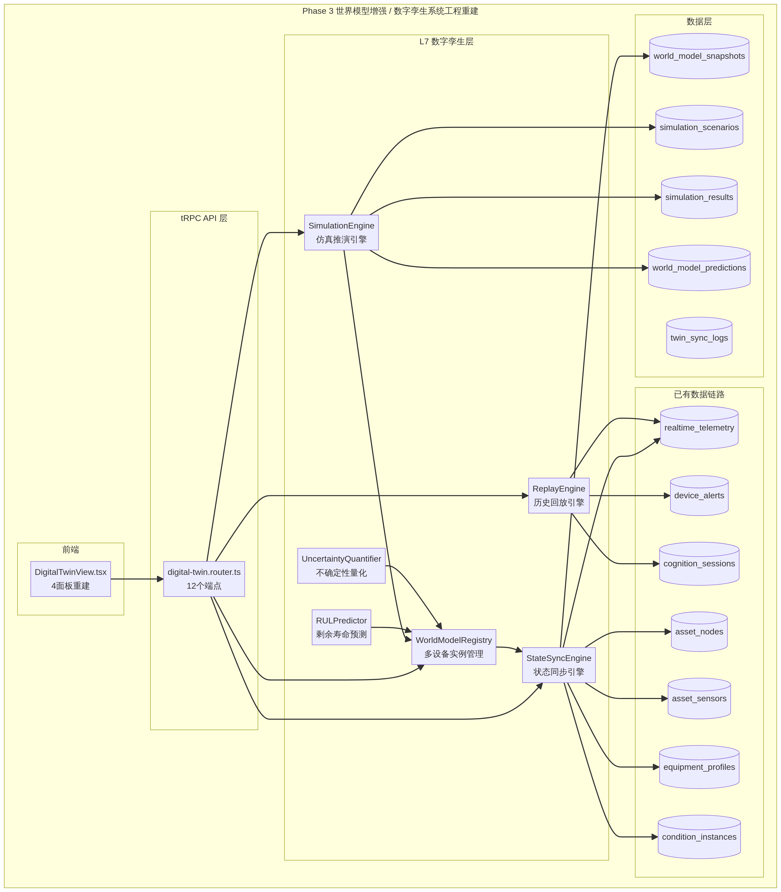
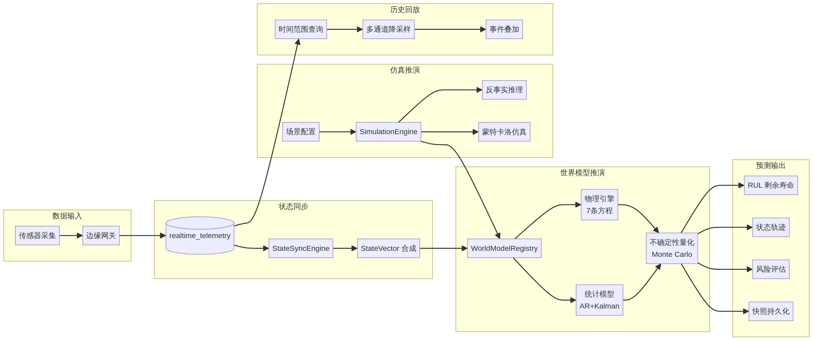

# Phase 3 技术设计方案：世界模型增强 / 数字孪生系统工程重建

> **文档版本**: v1.0  
> **日期**: 2026-02-22  
> **作者**: Manus AI  
> **状态**: 待审阅  
> **前置**: Phase 1（感知层增强）✅ Phase 2（认知层推理引擎增强）✅

---

## 一、背景与目标

### 1.1 现状审计

经过对现有代码库的深度审计，当前数字孪生子系统存在以下核心差距：

| 维度 | 现状 | 差距 |
|------|------|------|
| **WorldModel** (621行) | 单实例、纯内存、7条物理方程完整 | 无多设备管理、无状态同步、无不确定性量化、无RUL预测 |
| **pipeline.domain-router** (181行) | 5个Facade端点，`listDigitalTwins`从DB读取但状态向量用`Math.random()` | `runSimulation`/`startReplay`为空壳，仿真场景硬编码 |
| **DigitalTwinView** (387行) | 三Tab展示型demo（设备状态/仿真/回放） | 前端数据全部来自硬编码或随机数，无真实数据链路 |
| **数据库** | `world_model_snapshots` + `world_model_predictions` 表已定义 | 无`simulation_scenarios`表，无仿真结果持久化，无同步日志 |
| **Seed数据** | `equipment_profiles` 5台设备已有 | 无`world_model_snapshots`种子数据，无遥测历史数据 |

WorldModel 类本身的物理引擎质量较高，7条方程覆盖了风载力矩（M_wind = ½ρv²·A·h/2）、疲劳增量（Δσ = k × M / W）、S-N 曲线寿命（N = C / (Δσ)^m）、腐蚀速率（r = k·[Cl⁻]·[humidity]）、倾覆安全系数（K = M_stab / M_overturn）、热传导简化模型和振动预测模型。这些方程是 Phase 3 增强的坚实基础，不需要重写，只需要在其上层构建多设备管理、状态同步和不确定性量化能力。

### 1.2 设计目标

将数字孪生从**展示型 demo** 升级为**商业级系统工程**，实现三个核心能力：

1. **实时数字映射** — 每台设备拥有独立的 WorldModel 实例，状态向量从 `realtime_telemetry` 实时同步，而非 `Math.random()`
2. **仿真推演引擎** — 支持场景配置、物理仿真执行、反事实推理、蒙特卡洛不确定性量化，结果持久化到数据库
3. **历史回放引擎** — 从 `realtime_telemetry` 查询多通道时序数据，叠加告警/诊断/工况事件，支持降采样和时间轴控制

### 1.3 架构定位

Phase 3 在平台整体架构中的位置为 **L7 数字孪生层**，位于 L2 认知诊断层之上，与 L6 管线层平行。其数据链路完全复用平台已有表（`asset_nodes`、`asset_sensors`、`realtime_telemetry`、`device_alerts`、`cognition_sessions`、`equipment_profiles`、`condition_instances`），不重复建设。



---

## 二、数据链路设计

### 2.1 数据流全景

数字孪生的数据来源于平台已有的完整数据链路，从传感器采集到认知诊断形成闭环：



### 2.2 数据源表映射

Phase 3 完全复用平台已有的数据链路，不重复建设。以下是各功能模块与数据源表的精确映射关系：

| 功能模块 | 数据源表 | 读写模式 | 关键字段 |
|----------|----------|----------|----------|
| 设备列表 | `asset_nodes` (nodeType='device') + `equipment_profiles` | 只读 | nodeId, name, type, location, status |
| 传感器映射 | `asset_sensors` JOIN `asset_measurement_points` | 只读 | sensorId, mpId, position, measurementType |
| 实时数据 | `realtime_telemetry` | 只读 | deviceCode, mpCode, timestamp, value, unit, isAnomaly |
| 健康评估 | `cognition_sessions` + `cognition_dimension_results` | 只读 | safetyScore, healthScore, efficiencyScore, diagnosticsJson |
| 世界模型快照 | `world_model_snapshots` | 读写 | machineId, stateVector, healthIndex, predictions |
| 预测结果 | `world_model_predictions` | 读写 | snapshotId, horizonMinutes, predictedState |
| 告警状态 | `device_alerts` | 只读 | nodeId, alertType, severity, status, triggerValue |
| 工况上下文 | `condition_instances` | 只读 | profileId, machineId, startedAt, stateSnapshot |
| 仿真场景 | `simulation_scenarios` **（新增）** | 读写 | equipmentId, scenarioType, parameters, result |
| 仿真结果 | `simulation_results` **（新增）** | 读写 | scenarioId, timeline, riskAssessment |
| 同步日志 | `twin_sync_logs` **（新增）** | 只写 | machineId, syncType, stateVector, durationMs |

### 2.3 设备ID映射规则

当前系统中存在两套设备标识体系，需要在 StateSyncEngine 中统一映射：

| 标识体系 | 格式 | 使用场景 |
|----------|------|----------|
| `asset_nodes.node_id` | 如 `NODE-xxx` | 资产管理、传感器、告警 |
| `cognition_sessions.machine_id` | 如 `EQ-001` | 认知诊断、世界模型快照 |
| `realtime_telemetry.device_code` | 如 `CRANE-001` | 遥测数据 |
| `equipment_profiles.id` | 数字自增 | 设备档案 |

StateSyncEngine 需要维护一个 **设备ID映射表**（内存缓存），在启动时从 `asset_nodes` + `equipment_profiles` 构建，将四种ID统一映射到 `machineId`（以 `EQ-xxx` 为主键）。

---

## 三、后端模块设计

### 3.1 WorldModel 增强 — `world-model-enhanced.ts`

**设计原则**：不修改现有 `world-model.ts`，而是在其上层构建增强层，通过组合模式扩展能力。

#### 3.1.1 WorldModelRegistry — 多设备实例管理

```
职责：设备ID → WorldModel 实例的生命周期管理
模式：Singleton Registry + Lazy Initialization
容量：最大 100 台设备实例（LRU 淘汰）
```

WorldModelRegistry 是整个数字孪生层的核心入口。它为每台设备维护一个独立的 WorldModel 实例，并根据 `equipment_profiles.world_model_config` 初始化物理参数。当设备首次被访问时，Registry 从数据库加载设备档案并创建实例（Lazy Init）；当实例数超过上限时，按 LRU 策略淘汰最久未访问的实例。

**核心接口设计**：

```typescript
interface WorldModelRegistry {
  /** 获取或创建设备的 WorldModel 实例 */
  getOrCreate(machineId: string): Promise<WorldModel>;
  
  /** 批量预热（启动时加载活跃设备） */
  warmup(machineIds: string[]): Promise<void>;
  
  /** 获取所有活跃实例的状态摘要 */
  getActiveInstances(): Map<string, { lastSyncAt: number; healthIndex: number }>;
  
  /** 销毁指定实例（设备下线时） */
  destroy(machineId: string): void;
  
  /** 更新设备物理参数（设备档案变更时） */
  updateConfig(machineId: string, config: Partial<WorldModelConfig>): void;
}
```

#### 3.1.2 StateSyncEngine — 状态同步引擎

```
职责：DB 遥测数据 ↔ WorldModel 内存状态的双向同步
同步频率：可配置，默认 5 秒
同步方向：realtime_telemetry → StateVector（上行）+ StateVector → world_model_snapshots（下行）
```

StateSyncEngine 是连接真实数据与世界模型的桥梁。它定期从 `realtime_telemetry` 表查询每台设备最新的传感器读数，将多个传感器值合成为一个 StateVector（与 Phase 1 的状态向量合成器对齐），然后注入对应设备的 WorldModel 实例。同时，它将 WorldModel 的状态快照定期写入 `world_model_snapshots` 表，实现状态持久化。

**状态向量合成规则**：

| StateVector 字段 | 数据来源 | 合成逻辑 |
|-----------------|----------|----------|
| `vibrationRms` | `realtime_telemetry` WHERE mpCode LIKE '%vibration%' | 最新值 |
| `motorCurrentMean` | `realtime_telemetry` WHERE mpCode LIKE '%current%' | 最近5条均值 |
| `windSpeedMean` | `realtime_telemetry` WHERE mpCode LIKE '%wind%' | 最近5条均值 |
| `temperatureBearing` | `realtime_telemetry` WHERE mpCode LIKE '%temp%bearing%' | 最新值 |
| `fatigueAccumPercent` | 上一次快照的累积值 + 本周期增量 | 物理方程计算 |
| `corrosionIndex` | 上一次快照的累积值 + 本周期增量 | 物理方程计算 |
| `overturningRisk` | 实时计算 | 物理方程计算 |
| `loadWeight` | `realtime_telemetry` WHERE mpCode LIKE '%load%' | 最新值 |
| `loadEccentricity` | `realtime_telemetry` WHERE mpCode LIKE '%eccentric%' | 最新值 |

**同步日志**：每次同步写入 `twin_sync_logs` 表，记录 machineId、syncType（'telemetry_ingest' | 'snapshot_persist'）、stateVector、durationMs、errorMessage。用于排查同步延迟和数据质量问题。

#### 3.1.3 UncertaintyQuantifier — 不确定性量化

```
职责：为 WorldModel 的预测结果附加置信区间
方法：蒙特卡洛采样（N=100 次）+ 参数扰动
输出：mean ± 2σ 的 95% 置信区间
```

现有 WorldModel 的 `predict()` 方法返回单一轨迹，缺乏不确定性信息。UncertaintyQuantifier 通过对物理参数添加高斯扰动（如空气密度 ±5%、迎风面积 ±3%），执行 N 次蒙特卡洛采样，然后对每个时间步的每个状态变量计算均值和标准差，输出带置信区间的预测结果。

**核心接口**：

```typescript
interface UncertaintyResult {
  /** 均值轨迹 */
  meanTrajectory: StateVector[];
  /** 上界轨迹（mean + 2σ） */
  upperBound: StateVector[];
  /** 下界轨迹（mean - 2σ） */
  lowerBound: StateVector[];
  /** 各维度的标准差序列 */
  stdDevByDimension: Record<string, number[]>;
  /** 采样次数 */
  sampleCount: number;
  /** 计算耗时 */
  durationMs: number;
}

interface UncertaintyQuantifier {
  /** 带不确定性的预测 */
  predictWithUncertainty(
    model: WorldModel,
    currentState: StateVector,
    horizon: number,
    sampleCount?: number  // 默认 100
  ): UncertaintyResult;
  
  /** 参数扰动配置 */
  setParameterNoise(paramName: string, relativeStdDev: number): void;
}
```

**参数扰动默认配置**：

| 物理参数 | 相对标准差 | 物理依据 |
|----------|-----------|----------|
| airDensity | 3% | 温度/气压变化 |
| windwardArea | 5% | 臂架角度变化 |
| stressConcentrationFactor | 8% | 焊接质量差异 |
| corrosionRateConstant | 10% | 环境微气候差异 |
| frictionCoefficient | 5% | 润滑状态变化 |

#### 3.1.4 RULPredictor — 剩余寿命预测

```
职责：基于疲劳累积 + 腐蚀 + S-N 曲线，预测设备剩余使用寿命
输出：RUL（天）+ 置信区间 + 主要退化因素排名
```

RULPredictor 利用 WorldModel 的物理方程进行长期外推（horizon = 365天），结合 UncertaintyQuantifier 的蒙特卡洛采样，计算疲劳累积达到 100% 或腐蚀指数达到 1.0 的预期时间。它还会输出主要退化因素的贡献度排名，帮助维护决策。

**核心接口**：

```typescript
interface RULResult {
  /** 预测剩余寿命（天） */
  remainingLifeDays: number;
  /** 置信区间下界（天） */
  lowerBound: number;
  /** 置信区间上界（天） */
  upperBound: number;
  /** 置信度 */
  confidence: number;
  /** 主要退化因素排名 */
  degradationFactors: Array<{
    factor: string;        // 如 'fatigue', 'corrosion', 'bearing_wear'
    contribution: number;  // 0-1，贡献度
    currentLevel: number;  // 当前水平
    criticalLevel: number; // 临界水平
    estimatedDaysToLimit: number;
  }>;
  /** 建议维护时间 */
  suggestedMaintenanceDate: string;  // ISO 8601
  /** 预测方法 */
  method: 'physics_extrapolation' | 'statistical' | 'hybrid';
}
```

#### 3.1.5 物理方程导出接口

为前端展示和 Grok 工具调用提供物理方程的结构化描述：

```typescript
interface PhysicsEquation {
  id: string;           // 如 'wind_moment'
  name: string;         // 如 '风载力矩'
  formula: string;      // LaTeX: 'M_{wind} = \\frac{1}{2}\\rho v^2 A \\frac{h}{2}'
  variables: Array<{
    symbol: string;     // 如 'ρ'
    name: string;       // 如 '空气密度'
    unit: string;       // 如 'kg/m³'
    currentValue: number;
  }>;
  physicalBasis: string; // 如 'GB/T 3811-2008 起重机设计规范'
  category: 'structural' | 'thermal' | 'degradation' | 'safety';
}
```

现有 WorldModel 的 7 条方程将通过新增的 `getKeyEquations()` 公开方法导出为上述结构，供前端世界模型配置面板展示，也供 Phase 2 的 PhysicsVerifier 调用。

---

### 3.2 SimulationEngine — 仿真推演引擎 — `simulation-engine.ts`

#### 3.2.1 仿真场景管理

仿真场景的完整生命周期管理，支持 CRUD 操作并持久化到 `simulation_scenarios` 表：

```typescript
interface SimulationScenarioConfig {
  equipmentId: string;
  name: string;
  description: string;
  scenarioType: 'overload' | 'thermal' | 'degradation' | 'resonance' | 'typhoon' | 'multi_factor' | 'custom';
  parameters: Record<string, number>;
  baselineConditionId?: string;
  durationSteps: number;
  stepIntervalSec: number;
}
```

**预置场景模板**（从现有 `WorldModel.getBuiltinScenarios()` 扩展）：

| 场景类型 | 名称 | 核心参数覆盖 | 持续步数 | 物理意义 |
|----------|------|-------------|----------|----------|
| typhoon | 台风场景 | windSpeedMean=18, windGustMax=25 | 60 | 模拟台风来袭时的结构安全 |
| overload | 重载偏心 | loadWeight=40, loadEccentricity=0.6 | 30 | 模拟货物严重偏心的倾覆风险 |
| degradation | 疲劳极限 | fatigueAccumPercent=82, vibrationRms=3.5 | 60 | 模拟疲劳接近极限时的连续作业 |
| thermal | 高温工况 | ambientTemp=45, coolingEfficiency=0.7 | 60 | 模拟高温环境下的热行为 |
| multi_factor | 多因素叠加 | windSpeedMean=12, loadEccentricity=0.4, fatigueAccumPercent=70, temperatureBearing=65 | 30 | 极端多因素叠加 |
| resonance | 共振分析 | speedRange=3000, stepSize=100 | 30 | 不同转速下的共振频率检测 |

#### 3.2.2 仿真执行器

仿真执行器是 SimulationEngine 的核心，负责将场景配置转化为物理仿真结果：

```
执行流程：
  1. 从 WorldModelRegistry 获取设备的 WorldModel 实例
  2. 从最新的 world_model_snapshots 加载基线状态向量
  3. 将场景参数覆盖到基线状态
  4. 调用 WorldModel.predict() 执行物理推演
  5. 对每步结果执行异常阈值检查
  6. 生成风险评估报告
  7. 将结果写入 simulation_results 表 + world_model_predictions 表
  8. 更新 simulation_scenarios 表状态为 'completed'
```

**执行结果结构**：

```typescript
interface SimulationResult {
  scenarioId: number;
  equipmentId: string;
  /** 时序轨迹 */
  timeline: Array<{
    step: number;
    timestamp: number;
    stateVector: Record<string, number>;
    anomalies: string[];  // 触发的异常维度
  }>;
  /** 风险评估 */
  riskAssessment: {
    maxOverturningRisk: number;
    maxFatigueAccum: number;
    maxVibration: number;
    maxTemperature: number;
    estimatedRULImpactDays: number;  // 对剩余寿命的影响
    overallRiskLevel: 'low' | 'medium' | 'high' | 'critical';
  };
  /** 物理解释 */
  physicsExplanation: string;
  /** 建议动作 */
  warnings: string[];
  /** 执行耗时 */
  durationMs: number;
}
```

#### 3.2.3 What-if 分析（反事实推理封装）

What-if 分析是对现有 `WorldModel.counterfactual()` 的高层封装，支持多参数组合的批量反事实推理：

```typescript
interface WhatIfAnalysis {
  /** 单参数 What-if */
  analyzeParameter(
    equipmentId: string,
    paramName: string,
    values: number[]  // 如 [10, 12, 14, 16, 18] 风速序列
  ): Promise<WhatIfResult[]>;
  
  /** 多参数组合 What-if */
  analyzeParameterGrid(
    equipmentId: string,
    paramGrid: Record<string, number[]>  // 如 { windSpeed: [10,15], loadWeight: [20,30,40] }
  ): Promise<WhatIfResult[]>;  // 返回 2×3=6 个结果
}
```

#### 3.2.4 多方案对比引擎

支持选择多个已完成的仿真场景进行并排对比：

```typescript
interface ComparisonResult {
  scenarios: Array<{
    scenarioId: number;
    name: string;
    parameters: Record<string, number>;
    riskAssessment: SimulationResult['riskAssessment'];
  }>;
  /** 归一化对比矩阵（每个维度 0-1 归一化） */
  normalizedComparison: Record<string, number[]>;
  /** 最优场景推荐 */
  recommendation: {
    safestScenarioId: number;
    reason: string;
  };
}
```

#### 3.2.5 蒙特卡洛仿真

对仿真场景执行 N 次蒙特卡洛采样，输出概率分布而非单一轨迹：

```
流程：
  1. 对场景参数添加高斯扰动（复用 UncertaintyQuantifier 的扰动配置）
  2. 执行 N=100 次仿真
  3. 对每步每维度计算 P5/P25/P50/P75/P95 分位数
  4. 计算"超过临界阈值"的概率
  5. 输出概率风险评估
```

**输出结构**：

```typescript
interface MonteCarloSimResult {
  sampleCount: number;
  /** 分位数轨迹 */
  percentiles: {
    p5: StateVector[];
    p25: StateVector[];
    p50: StateVector[];  // 中位数
    p75: StateVector[];
    p95: StateVector[];
  };
  /** 各维度超过临界阈值的概率 */
  exceedanceProbability: Record<string, number>;
  /** 综合风险概率 */
  overallRiskProbability: number;
}
```

---

### 3.3 ReplayEngine — 历史回放引擎 — `replay-engine.ts`

#### 3.3.1 时间范围查询

从 `realtime_telemetry` 表查询指定设备的可回放时间范围：

```typescript
interface TimeRangeResult {
  earliest: Date;
  latest: Date;
  totalDataPoints: number;
  /** 各通道的数据覆盖情况 */
  channelCoverage: Array<{
    mpCode: string;
    sensorName: string;
    dataPointCount: number;
    earliest: Date;
    latest: Date;
    gapCount: number;  // 数据断点数
  }>;
  /** 事件统计 */
  eventSummary: {
    alertCount: number;
    diagnosisCount: number;
    conditionChangeCount: number;
  };
}
```

#### 3.3.2 多通道数据查询

按设备 + 时间段 + 通道 + 降采样分辨率查询回放数据：

```typescript
interface ReplayDataRequest {
  equipmentId: string;
  startTime: Date;
  endTime: Date;
  channels: string[];  // mpCode 列表，空数组表示全部通道
  resolution: 'raw' | '1s' | '10s' | '1m' | '5m';
}

interface ReplayDataResult {
  /** 多通道时序数据 */
  channels: Array<{
    mpCode: string;
    sensorName: string;
    unit: string;
    data: Array<{
      t: number;      // Unix timestamp ms
      v: number;      // 值
      isAnomaly: boolean;
    }>;
  }>;
  /** 事件标注 */
  events: Array<{
    timestamp: number;
    type: 'alert' | 'diagnosis' | 'condition_change';
    title: string;
    severity: 'info' | 'warning' | 'error' | 'critical';
    details: string;
  }>;
  /** 数据统计 */
  stats: {
    totalPoints: number;
    downsampledFrom: number;
    timeSpanMs: number;
  };
}
```

**降采样策略**：

| 分辨率 | 策略 | 适用场景 |
|--------|------|----------|
| raw | 不降采样 | 短时间段（<1小时）精细分析 |
| 1s | 每秒取最后一条 | 短时间段快速浏览 |
| 10s | 每10秒取均值 | 中等时间段（1-6小时） |
| 1m | 每分钟取均值 + 最大值 + 最小值 | 长时间段（6-24小时） |
| 5m | 每5分钟取均值 + 最大值 + 最小值 | 超长时间段（>24小时） |

#### 3.3.3 事件叠加

从三个事件源查询指定时间段内的事件，按时间排序后叠加到回放数据中：

| 事件源 | 表 | 事件类型 | 关键字段 |
|--------|-----|----------|----------|
| 告警 | `device_alerts` | alert | alertType, severity, title, triggerValue |
| 诊断 | `cognition_sessions` | diagnosis | triggerType, safetyScore, healthScore, grokExplanation |
| 工况切换 | `condition_instances` | condition_change | profileId, startedAt, stateSnapshot |

#### 3.3.4 异常片段定位

自动识别回放时间范围内的异常时间段，帮助用户快速定位关键事件：

```typescript
interface AnomalySegment {
  startTime: number;
  endTime: number;
  durationMs: number;
  anomalyType: string;
  severity: 'warning' | 'critical';
  affectedChannels: string[];
  peakValue: number;
  description: string;
}
```

---

## 四、数据库表设计

### 4.1 新增表：simulation_scenarios

```sql
CREATE TABLE simulation_scenarios (
  id              BIGINT AUTO_INCREMENT PRIMARY KEY,
  equipment_id    VARCHAR(100) NOT NULL COMMENT '设备ID (machineId)',
  name            VARCHAR(200) NOT NULL COMMENT '场景名称',
  description     TEXT COMMENT '场景描述',
  scenario_type   VARCHAR(30) NOT NULL COMMENT 'overload|thermal|degradation|resonance|typhoon|multi_factor|custom',
  parameters      JSON NOT NULL COMMENT '仿真参数 Record<string, number>',
  baseline_condition_id VARCHAR(100) COMMENT '基准工况ID',
  duration_steps  INT NOT NULL DEFAULT 30 COMMENT '仿真步数',
  step_interval_sec INT NOT NULL DEFAULT 60 COMMENT '步长(秒)',
  status          VARCHAR(20) NOT NULL DEFAULT 'draft' COMMENT 'draft|running|completed|failed',
  created_by      VARCHAR(64) COMMENT '创建者',
  created_at      TIMESTAMP(3) NOT NULL DEFAULT CURRENT_TIMESTAMP(3),
  updated_at      TIMESTAMP(3) NOT NULL DEFAULT CURRENT_TIMESTAMP(3) ON UPDATE CURRENT_TIMESTAMP(3),
  INDEX idx_ss_equipment (equipment_id),
  INDEX idx_ss_status (status),
  INDEX idx_ss_type (scenario_type)
) COMMENT '仿真场景表';
```

### 4.2 新增表：simulation_results

```sql
CREATE TABLE simulation_results (
  id              BIGINT AUTO_INCREMENT PRIMARY KEY,
  scenario_id     BIGINT NOT NULL COMMENT '关联 simulation_scenarios.id',
  equipment_id    VARCHAR(100) NOT NULL COMMENT '设备ID',
  timeline        JSON NOT NULL COMMENT '时序轨迹 Array<{step, timestamp, stateVector, anomalies}>',
  risk_assessment JSON NOT NULL COMMENT '风险评估 {maxOverturningRisk, maxFatigue, ...}',
  physics_explanation TEXT COMMENT '物理解释文本',
  warnings        JSON COMMENT '建议动作 string[]',
  duration_ms     INT COMMENT '执行耗时(ms)',
  completed_at    TIMESTAMP(3),
  created_at      TIMESTAMP(3) NOT NULL DEFAULT CURRENT_TIMESTAMP(3),
  INDEX idx_sr_scenario (scenario_id),
  INDEX idx_sr_equipment (equipment_id)
) COMMENT '仿真执行结果表';
```

### 4.3 新增表：twin_sync_logs

```sql
CREATE TABLE twin_sync_logs (
  id              BIGINT AUTO_INCREMENT PRIMARY KEY,
  machine_id      VARCHAR(100) NOT NULL COMMENT '设备ID',
  sync_type       VARCHAR(30) NOT NULL COMMENT 'telemetry_ingest|snapshot_persist|config_update',
  state_vector    JSON COMMENT '同步时的状态向量',
  sensor_count    INT COMMENT '同步的传感器数量',
  duration_ms     INT COMMENT '同步耗时(ms)',
  error_message   TEXT COMMENT '错误信息(如有)',
  created_at      TIMESTAMP(3) NOT NULL DEFAULT CURRENT_TIMESTAMP(3),
  INDEX idx_tsl_machine (machine_id),
  INDEX idx_tsl_time (created_at),
  INDEX idx_tsl_type (sync_type)
) COMMENT '数字孪生状态同步日志';
```

### 4.4 Drizzle Schema 对应

三张新表需要在 `drizzle/evolution-schema.ts` 中添加对应的 Drizzle ORM 定义，遵循现有的命名规范（camelCase 字段名、mysqlTable 工厂函数、$type 类型注解）。

### 4.5 Seed 数据补充

| 表 | 补充内容 | 数量 |
|----|----------|------|
| `world_model_snapshots` | 为 5 台设备各生成 3 个快照（含完整状态向量、健康指数、预测） | 15 条 |
| `simulation_scenarios` | 预置 6 个仿真场景模板（对应 6 种场景类型） | 6 条 |
| `simulation_results` | 为 2 个已完成场景生成结果数据 | 2 条 |

---

## 五、tRPC 路由设计

### 5.1 路由注册位置

新路由将注册到 `server/domains/pipeline/pipeline.domain-router.ts`，替换现有的 5 个 Facade 空壳方法。路由前缀保持 `evoPipeline.*`，与前端已有的 tRPC 调用路径兼容。

### 5.2 端点清单

| 端点 | 类型 | 输入 | 输出 | 替换的现有端点 |
|------|------|------|------|---------------|
| `listEquipmentTwins` | query | 无 | 设备孪生概览列表 | 替换现有 `listDigitalTwins` |
| `getEquipmentTwinState` | query | `{ equipmentId }` | 单台设备完整孪生状态 | 新增 |
| `simulation.list` | query | `{ equipmentId? }` | 仿真场景列表 | 替换现有 `listSimulationScenarios` |
| `simulation.create` | mutation | 场景配置 | 创建结果 | 新增 |
| `simulation.execute` | mutation | `{ scenarioId }` | 仿真结果 | 替换现有 `runSimulation` |
| `simulation.compare` | query | `{ scenarioIds[] }` | 多方案对比结果 | 新增 |
| `simulation.delete` | mutation | `{ scenarioId }` | 删除确认 | 新增 |
| `replay.getTimeRange` | query | `{ equipmentId }` | 可回放时间范围 | 新增 |
| `replay.getData` | query | 时间段+通道+分辨率 | 多通道回放数据 | 替换现有 `listReplaySessions` |
| `worldmodel.getConfig` | query | `{ equipmentId }` | 世界模型配置 | 新增 |
| `worldmodel.getEquations` | query | `{ equipmentId }` | 物理方程列表 | 新增 |
| `worldmodel.predict` | mutation | `{ equipmentId, horizon }` | 带不确定性的预测结果 | 新增 |

### 5.3 关键端点详细设计

#### `getEquipmentTwinState` — 设备完整孪生状态聚合

这是数字孪生最核心的端点，聚合来自 6 张表的数据为一个完整的设备孪生视图：

```typescript
// 输出结构
{
  equipment: {
    nodeId, name, type, manufacturer, model, location, status,
    physicalConstraints, failureModes, worldModelConfig
  },
  sensors: Array<{
    sensorId, name, position, physicalQuantity, unit,
    currentValue, warningThreshold, criticalThreshold,
    status: 'normal' | 'warning' | 'critical' | 'offline',
    lastReadingAt, trend: number[]  // 最近10个读数
  }>,
  health: {
    overallScore, safetyScore, healthScore, efficiencyScore,
    lastDiagnosisAt, diagnosisCount
  },
  worldModel: {
    stateVector, healthIndex, predictions,
    rul: RULResult,  // 剩余寿命预测
    equations: PhysicsEquation[]  // 物理方程
  },
  activeAlerts: Array<{ alertId, type, title, severity, triggerValue, createdAt }>,
  currentCondition: { profileName, trigger, startedAt },
  syncStatus: 'synced' | 'stale' | 'disconnected',
  lastSyncAt: string
}
```

#### `simulation.execute` — 执行仿真

```typescript
// 输入
{ scenarioId: number }

// 执行流程
1. 从 simulation_scenarios 读取场景配置
2. 从 WorldModelRegistry 获取设备 WorldModel
3. 从 world_model_snapshots 加载最新基线状态
4. 执行物理仿真（WorldModel.predict + 参数覆盖）
5. 可选：执行蒙特卡洛采样（如果 scenario.enableMonteCarlo）
6. 生成风险评估 + 物理解释
7. 写入 simulation_results + world_model_predictions
8. 更新 simulation_scenarios.status = 'completed'
9. 返回 SimulationResult
```

---

## 六、前端设计

### 6.1 整体布局

DigitalTwinView 重建为 **4 个 Tab 面板**，替换现有的 3 Tab demo：

| Tab | 名称 | 核心功能 |
|-----|------|----------|
| 1 | 设备状态 | 设备选择器 + 传感器实时数据 + 健康仪表盘 + 告警列表 + RUL |
| 2 | 仿真推演 | 场景列表 + 参数配置 + 执行 + 结果可视化(Chart.js) + 多方案对比 |
| 3 | 历史回放 | 时间轴控制器 + 多通道折线图 + 事件标注 + 异常片段快速定位 |
| 4 | 世界模型 | 物理方程展示 + 参数配置 + 预测验证 + 不确定性可视化 |

### 6.2 设备状态面板

**布局**：顶部设备选择器（下拉） + 左侧健康仪表盘 + 右侧传感器数据表格 + 底部告警列表

**数据刷新**：5 秒轮询 `getEquipmentTwinState`（与现有刷新策略一致）

**关键组件**：
- **健康评分仪表盘**：环形进度条展示 safetyScore / healthScore / efficiencyScore，颜色编码（绿>80/黄60-80/红<60）
- **RUL 卡片**：剩余寿命天数 + 置信区间 + 主要退化因素排名
- **传感器数据表格**：通道名、当前值、阈值、状态Badge、趋势迷你图（最近10个读数的 sparkline）
- **活跃告警列表**：按严重程度排序，显示告警类型、触发值、时间

### 6.3 仿真推演面板

**布局**：上方场景列表表格 + 下方推演工作台

**场景列表**：
- 表格展示已有场景（名称、类型、参数摘要、状态Badge、创建时间）
- "创建场景"按钮 → 弹出配置对话框（选择设备、场景类型下拉、参数滑块调节）
- "执行"按钮 → 触发仿真 → 状态从 draft → running → completed
- "对比"按钮 → 选择多个已完成场景 → 并排展示对比图表

**推演结果可视化**（Chart.js）：
- 多维度时序折线图（每个状态变量一条线）
- 阈值线（虚线标注 warning/critical）
- 风险评估卡片（最大倾覆风险、最大疲劳累积、RUL影响）
- 蒙特卡洛结果：带状图（P5-P95 置信区间）

### 6.4 历史回放面板

**布局**：顶部时间轴控制器 + 中部多通道数据图 + 底部事件列表

**时间轴控制器**：
- 日期范围选择器（DatePicker）
- 分辨率选择器（raw/1s/10s/1m/5m）
- 播放/暂停按钮（前端模拟播放，逐步移动时间光标）
- 播放速度选择（1x/2x/4x/8x）
- 进度条（可拖拽跳转）

**多通道数据图**（Chart.js）：
- 每个传感器通道一条折线
- 异常点红色标注（isAnomaly=true 的数据点）
- 阈值线（虚线）
- 事件标记（垂直线 + 图标：红色=告警、蓝色=诊断、绿色=工况切换）

**事件列表**：
- 表格展示时间段内的所有事件
- 点击事件 → 时间光标跳转到对应时间点
- 异常片段高亮（背景色标注异常时间段）

### 6.5 世界模型面板

**布局**：左侧物理方程列表 + 右侧预测可视化

**物理方程展示**：
- 7 条方程的结构化展示（名称、公式、变量当前值、物理依据）
- 参数编辑器（滑块调节物理参数，如空气密度、迎风面积等）

**预测可视化**：
- 带不确定性的预测轨迹图（均值线 + P5-P95 带状区间）
- 各维度的标准差随时间变化图
- 预测 vs 实际对比（如果有 `world_model_predictions.actualState` 数据）

---

## 七、与平台已有模块的集成

### 7.1 与 Phase 2 认知层的集成

| 集成点 | 方式 | 说明 |
|--------|------|------|
| PhysicsVerifier | WorldModel 导出 `getKeyEquations()` | PhysicsVerifier 调用此方法获取物理方程作为验证基准 |
| HybridOrchestrator | WorldModel 的 `predict()` + `counterfactual()` | 编排器在 S4 物理验证阶段调用世界模型 |
| CausalGraph | WorldModel 的 `anticipateAnomaly()` | 因果图在反事实干预时调用异常预判 |

### 7.2 与感知层的集成

| 集成点 | 方式 | 说明 |
|--------|------|------|
| StateVectorEncoder | StateSyncEngine 复用编码逻辑 | 状态向量合成规则与感知层的编码器对齐 |
| ConditionManager | 复用 `condition_instances` | 工况上下文直接从感知层读取 |

### 7.3 与护栏层的集成

| 集成点 | 方式 | 说明 |
|--------|------|------|
| GuardrailEngine | 仿真结果触发护栏规则检查 | SimulationEngine 执行后可选调用 GuardrailEngine 评估 |
| device_alerts | ReplayEngine 读取告警事件 | 历史回放叠加告警标注 |

### 7.4 与进化层的集成

| 集成点 | 方式 | 说明 |
|--------|------|------|
| KnowledgeCrystallizer | 仿真结果可作为知识结晶输入 | 有价值的仿真发现自动进入知识结晶流程 |
| ShadowEvaluator | WorldModel 预测准确性评估 | 影子评估器对比预测与实际，评估模型质量 |

---

## 八、实施计划

### 8.1 文件清单与预估工作量

| 序号 | 文件路径 | 类型 | 预估行数 | 依赖 |
|------|----------|------|---------|------|
| 1 | `server/platform/cognition/worldmodel/world-model-enhanced.ts` | 新增 | ~800 | world-model.ts |
| 2 | `server/platform/cognition/worldmodel/simulation-engine.ts` | 新增 | ~600 | world-model-enhanced.ts |
| 3 | `server/platform/cognition/worldmodel/replay-engine.ts` | 新增 | ~400 | drizzle schema |
| 4 | `server/platform/cognition/worldmodel/index.ts` | 修改 | +20 | 新增导出 |
| 5 | `drizzle/evolution-schema.ts` | 修改 | +80 | 3张新表 |
| 6 | `docker/mysql/init/03-v5-seed-data.sql` | 修改 | +100 | seed数据 |
| 7 | `server/domains/pipeline/pipeline.domain-router.ts` | 重写 | ~500 | 12个端点 |
| 8 | `client/src/pages/cognitive/DigitalTwinView.tsx` | 重写 | ~900 | 4面板 |
| **合计** | | | **~3400** | |

### 8.2 实施顺序

```
Step 1: DB Schema + Seed 数据（P3-4）
  ↓
Step 2: WorldModel 增强层（P3-1）
  ↓
Step 3: SimulationEngine + ReplayEngine（P3-2, P3-3）
  ↓
Step 4: tRPC 路由重建（P3-5）
  ↓
Step 5: 前端 DigitalTwinView 重建（P3-6）
  ↓
Step 6: TypeScript 编译验证 + 集成测试（P3-7）
  ↓
Step 7: Git 推送
```

### 8.3 风险与缓解

| 风险 | 影响 | 缓解措施 |
|------|------|----------|
| 遥测数据量大导致回放查询慢 | 历史回放面板加载超时 | 降采样策略 + 分页查询 + 前端虚拟滚动 |
| 蒙特卡洛 100 次采样计算耗时 | 仿真执行超过 10 秒 | 异步执行 + 进度回调 + 可配置采样次数 |
| 设备ID映射不一致 | 数据关联失败 | StateSyncEngine 启动时构建映射表 + 日志告警 |
| 前端 Chart.js 大数据量渲染卡顿 | 回放面板卡顿 | 降采样 + Canvas 渲染 + 数据点上限 |

---

## 九、验收标准

| 编号 | 验收项 | 标准 |
|------|--------|------|
| AC-1 | 设备状态面板 | 5 台设备均可选择，传感器数据从 DB 读取（非 Math.random），5秒刷新 |
| AC-2 | 仿真场景 CRUD | 可创建/执行/删除仿真场景，结果持久化到 DB |
| AC-3 | 仿真结果可视化 | Chart.js 展示时序轨迹 + 阈值线 + 风险评估 |
| AC-4 | 多方案对比 | 选择 2+ 场景并排对比，归一化展示 |
| AC-5 | 历史回放 | 选择时间范围后展示多通道折线图 + 事件标注 |
| AC-6 | 降采样 | 5 种分辨率可切换，大时间范围不卡顿 |
| AC-7 | 世界模型面板 | 展示 7 条物理方程 + 参数编辑 + 预测可视化 |
| AC-8 | RUL 预测 | 展示剩余寿命 + 置信区间 + 退化因素排名 |
| AC-9 | TypeScript | 编译零错误 |
| AC-10 | 数据库 | 3 张新表创建成功，seed 数据正确 |
