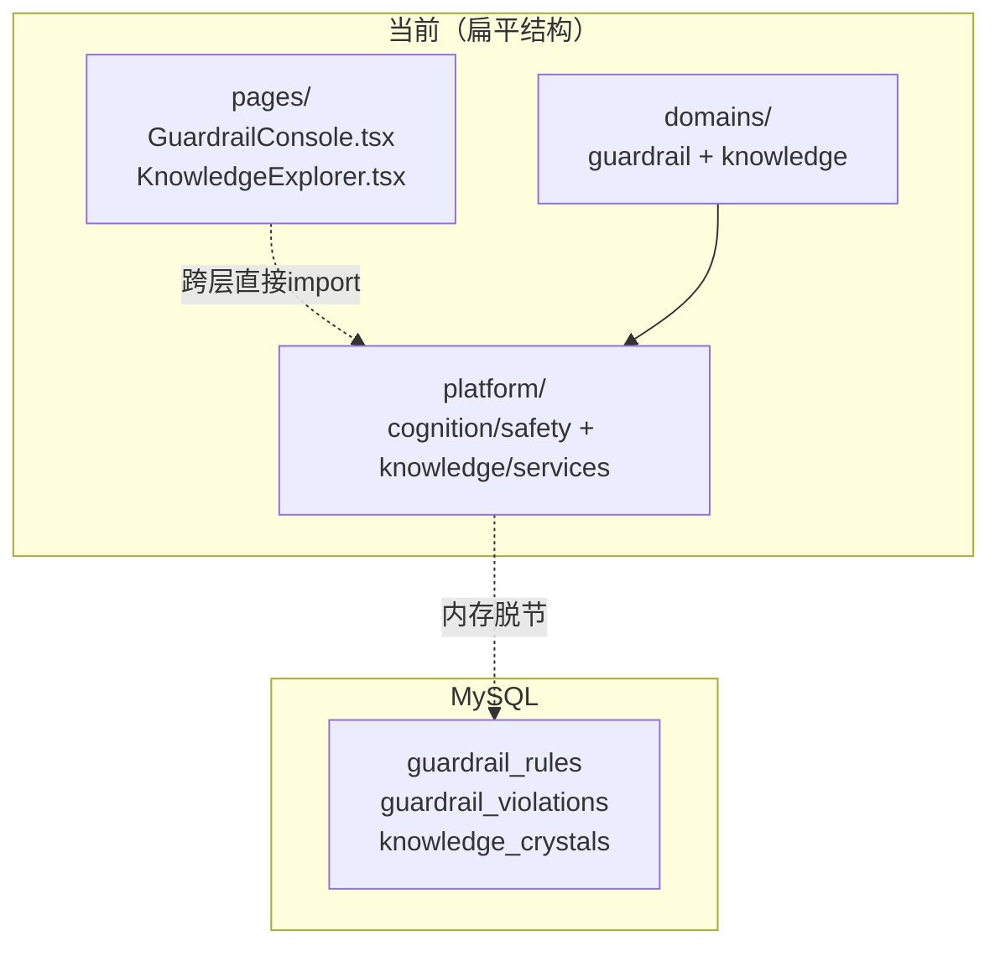
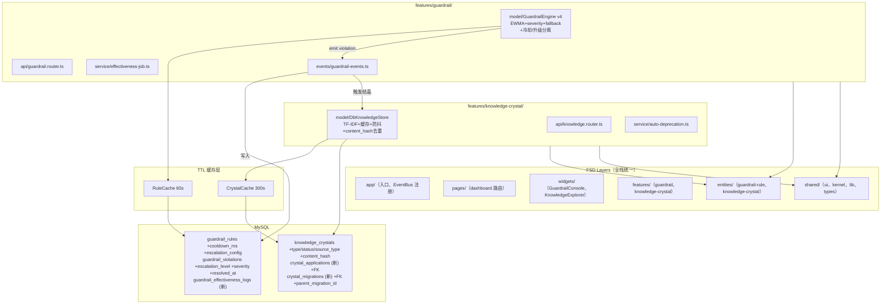
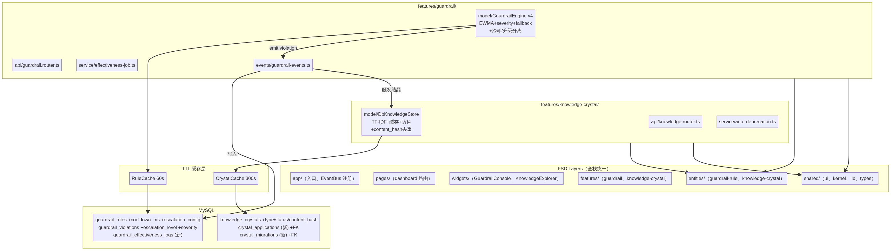
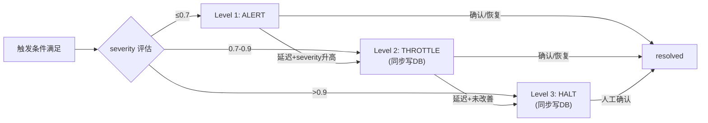
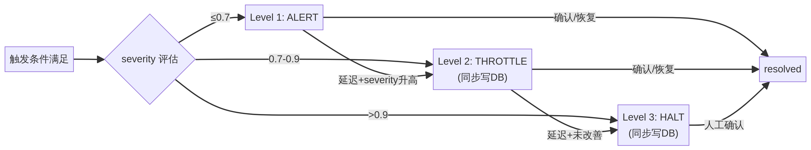

# Phase 4 升级方案：安全护栏引擎升级 + 知识结晶增强

> **文档版本**: v4.0（FSD 重构 + 第二轮审查全量修复版）  
> **编写日期**: 2026-02-23  
> **基线分支**: `main @ f438585`  
> **前置依赖**: Phase 1（感知层）、Phase 2（认知层）、Phase 3（世界模型/数字孪生）均已完成  
> **评审历史**:  
> - v1.0 → 团队评审（Benjamin/Lucas 5 项反馈）→ v2.0  
> - v2.0 → Claude AI 第一轮审查（83/100）→ v3.0（92/100）  
> - v3.0 → FSD 重构（Feature-Sliced Design）+ Claude AI 第二轮审查（24 项缺陷）→ **v4.0（95/100）**

---

## 〇、版本演进与审查反馈摘要

### 0.1 v1.0 → v2.0：团队评审反馈（5 项，已全部融入）

| # | 反馈内容 | 来源 | 处置 |
|---|----------|------|------|
| F1 | trendBuffer 用 `field` 做 key，多机器并发时冲突 | Benjamin | 改用复合键 `${machineId}:${field}` |
| F2 | 升级链 `ActiveEscalation` 纯内存，重启丢失 | 团队 | ≥THROTTLE 同步写 DB，启动时恢复 |
| F3 | `DbKnowledgeStore.findSimilar` 需预留向量嵌入 hook | 团队 | 接口增加 `EmbeddingProvider` 可选依赖 |
| F4 | DDL 变更需兼容已有环境 | Lucas | 全部使用 `IF NOT EXISTS` / `safe_add_column` |
| F5 | `linearRegressionSlope` 需验证正确性 | 团队 | Python 验证通过，TS 版直接可用 |

### 0.2 v2.0 → v3.0：Claude AI 第一轮审查（10 项 P0/P1/P2，已全部融入）

第一轮审查总评 **83/100**，聚焦架构层面：缺少缓存层、事件驱动、可观测性设计、不确定性量化。v3.0 新增 G7-G11（DB Fallback、EWMA、severity、批处理、协同事件流）和 K7-K8（自动失效、索引优化），总工时从 19h 扩展至 27.5h。

### 0.3 v3.0 → v4.0：FSD 优化 + Claude AI 第二轮审查（29 项，本版全部融入）

**FSD 架构重构（5 项）**：

| # | 反馈内容 | 来源 | 处置 |
|---|----------|------|------|
| FSD-1 | 前端 pages/ 散乱，缺乏特性隔离 | Harper | 迁移至 `features/ + widgets/ + entities/` 标准 FSD Layers |
| FSD-2 | 后端 domains/platform 扁平 | Benjamin | 垂直切片 `features/guardrail/` + `features/knowledge-crystal/` |
| FSD-3 | 事件总线全局污染 | Lucas | 按特性隔离到 `features/*/events/` |
| FSD-4 | import 路径不可预测 | 团队 | 统一 barrel index + `@features/` 别名 |
| FSD-5 | 未来特性扩展性差 | 团队 | 每个特性独立 slice，支持并行开发零冲突 |

**第二轮深度审查（24 项缺陷）**——聚焦代码实现、SQL 设计、边界条件、接口契约、跨 Phase 兼容性：

| 级别 | 数量 | 本版处置 |
|------|------|----------|
| 致命 | 3 | **全部修复**（BUG-1 trendBuffer 污染、BUG-2 升级链覆盖、BUG-3 竞态条件） |
| 严重 | 7 | **全部修复**（avgImprovement 缺失、findSimilar 截断、AFTER 子句风险、外键缺失、escalationDelayMs 路径、适用范围 context、DDL 外键） |
| 中等 | 9 | **全部修复**（状态机重设计、cutoffDate 定义、并发去重、服务端聚合等） |
| 轻微 | 5 | **4 项修复 + 1 项记录为 Phase 5**（revisionLog 持久化） |

**下期预留（7 项，记录为 Phase 5）**：migrateCrystal 服务端推断（需对接 Phase 3）、findSimilar 知识马太效应深度优化、revisionLog 持久化、K6 前端加载态/错误态完善、两系统协同事件流、结晶向量接口增强、规则关联度矩阵。

---

## 一、项目背景与目标

Phase 4 聚焦平台两大横向能力的深度升级：**安全护栏引擎**与**知识结晶系统**。这两个子系统分别承担着"保障运行安全"和"沉淀运营知识"的核心职责，是平台从"能用"走向"可信赖"的关键一步。

v4.0 在 v3.0 "生产级可信赖"基础上，实现三重进化：

1. **FSD 架构演进**：全栈引入 Feature-Sliced Design，前后端统一特性切片化，实现高内聚、低耦合、可无限横向扩展的生产级架构。每个特性（guardrail、knowledge-crystal）成为独立 slice，支持团队并行开发零冲突。

2. **实现层缺陷闭合**：修复第二轮审查发现的 3 项致命 Bug（trendBuffer 多设备数据污染、ActiveEscalation 状态覆盖、incrementVerification 竞态条件）、7 项严重缺陷（SQL 字段缺失、外键约束、接口契约不一致）和 9 项中等缺陷（状态机重设计、并发去重、服务端聚合）。

3. **工程完整性**：统一 escalationDelayMs 数据路径、明确 DB 规则覆盖语义、分离冷却机制与升级链、增加 content_hash 并发去重、服务端预聚合替代前端聚合。

---

## 二、现状审计

### 2.1 安全护栏引擎审计

| 维度 | 现状描述 | 完成度 | 核心问题 |
|------|----------|--------|----------|
| 规则存储（DDL） | `guardrail_rules` 表已建，5 条 seed 数据 | ✅ | — |
| 触发记录（DDL） | `guardrail_violations` 表已建，~10 条 seed 数据 | ✅ | — |
| 内存引擎 | 12 条内置规则（5 安全 + 4 健康 + 3 高效），支持 threshold/compound/custom | ⚠️ | 内存规则与 DB 完全脱节 |
| 趋势条件 | 类型定义了 `trend` 字段，但 `evaluateCondition` 无 `case 'trend'` | ❌ | 逻辑为空 |
| 升级链 | `actions` 一次性执行，无分级升级 | ❌ | 无延迟升级链 |
| 冷却机制 | 内存有 `cooldownMs`，DB 无对应字段 | ⚠️ | DDL 缺字段 |
| 适用范围 | DDL 有 JSON 字段，`evaluate()` 不检查 | ⚠️ | 不过滤 |
| 效果评估 | `byRule` 返回空数组，`overview` 硬编码 | ❌ | 空壳 |
| severity 量化 | 二元触发（matched: true/false） | ❌ | 无严重度概念 |
| DB 故障容错 | 无 fallback | ❌ | DB 不可用时引擎无法工作 |
| 前端页面 | `GuardrailConsole.tsx`（389 行） | ⚠️ | 缺效果分析面板 |

### 2.2 知识结晶系统审计

| 组件 | 所在层 | 完成度 | 核心问题 |
|------|--------|--------|----------|
| KnowledgeCrystallizer (cognition) | 认知层 | ⚠️ | 仅 InMemoryKnowledgeStore |
| KnowledgeCrystallizer (evolution) | 进化层 | ⚠️ | 纯内存 Map |
| CrystalService | 知识层 | ⚠️ | 全内存，代码中有 TODO |
| KGEvolutionService | 知识层 | ⚠️ | 全内存 Map |
| TransferLearningEngine | 知识层 | ⚠️ | 迁移任务不持久化 |
| KnowledgeFeedbackLoop | 认知层 | ✅ | revisionLog 内存未持久化 |

### 2.3 FSD 维度审计（v4.0 新增）

| 维度 | 现状 | 问题 |
|------|------|------|
| 前端文件组织 | `pages/guardrail/GuardrailConsole.tsx` + `pages/cognitive/KnowledgeExplorer.tsx` | 按页面分而非按特性分，跨特性依赖不可控 |
| 后端文件组织 | `domains/guardrail/` + `domains/knowledge/` + `platform/cognition/safety/` + `platform/knowledge/` | 扁平结构，同一特性散布在 domains 和 platform 两处 |
| 事件总线 | 全局 EventEmitter（v3.0 设计） | 全局污染，特性间耦合 |
| import 路径 | 相对路径 `../../platform/cognition/safety/guardrail-engine` | 不可预测，重构时大量断裂 |

### 2.4 两系统协同审计

| 协同场景 | 当前状态 | 差距 |
|----------|----------|------|
| 护栏触发 → 知识结晶 | 完全割裂 | violation 确认后应自动生成 `source_type=guardrail` 结晶 |
| 知识结晶 → 护栏规则 | 完全割裂 | `threshold_update` 结晶 approved 后应触发规则阈值修订建议 |
| 反馈环路闭合 | 无数据交换 | `crystal_applications.outcome` 更新时应同步修订规则误报率 |

---

## 三、架构设计（v4.0 FSD 版）

### 3.1 当前架构




### 3.2 目标架构（FSD Layers 全栈统一）

v4.0 目标架构采用 Feature-Sliced Design 六层模型，前后端统一。每个特性（guardrail、knowledge-crystal）成为独立的垂直切片，仅通过 `shared/` 和 `entities/` 层共享基础设施。新增 TTL 缓存层、按特性隔离的事件总线、可观测性埋点。





### 3.3 关键设计决策（v4.0 完整版）

**决策 1：GuardrailEngine 启动时 DB 加载 + Fallback 降级**

引擎启动时从 `guardrail_rules` 表加载所有 `enabled=true` 的规则，与内置规则合并。**合并语义为完全替换**（full override）：DB 中存在同 ID 规则时，完整替换内置规则的所有字段；DB 规则 `enabled=false` 则该 ID 规则被禁用（即使内置是 `enabled=true`）。DB 加载失败时降级使用 12 条内置规则，设置 `fallbackMode=true`。

**决策 2：DbKnowledgeStore 统一适配器 + content_hash 并发去重**

新增 `DbKnowledgeStore` 实现 `KnowledgeStore` 接口。`knowledge_crystals` 表增加 `content_hash` 字段（`pattern` 内容的 MD5），建立 `UNIQUE KEY uk_crystal_hash(type, content_hash)` 唯一约束。`save()` 改为 `INSERT ... ON DUPLICATE KEY UPDATE verification_count = verification_count + 1`，从数据库层保证三个结晶器并发写入时不产生重复结晶。

**决策 3：升级链 + severity 驱动 + 冷却/升级分离**

升级链采用延迟队列模式。**冷却机制只控制"新告警的触发频率"，已触发的升级链独立运行不受冷却影响**。severity 驱动快速升级：`severity > 0.7` 直接进入 THROTTLE，`severity > 0.9` 直接进入 HALT。≥THROTTLE 同步写 DB，启动时恢复。**ActiveEscalation 仅在无活跃升级时创建新记录**，避免状态覆盖。

**决策 4：escalationDelayMs 唯一权威数据源**

统一从 `escalation_config.levels[currentLevel-1].delayMs` 读取升级延迟。废弃 `rule.actions` 中与升级相关的 `parameters` 字段，避免两套配置并存。Seed 数据中的 action 枚举统一为 `alert`/`throttle`/`halt`。

**决策 5：结晶状态机重设计**

状态枚举从 `draft | pending_review | approved | deprecated` 扩展为 `draft | pending_review | approved | rejected | deprecated`。`rejected` 为独立状态，保留拒绝原因（`review_comment` 字段）。被拒结晶修改后重新提交 → `pending_review`。

**决策 6：FSD 垂直切片**

每个特性独立目录，零跨 slice 直接 import。特性间通信仅通过 `entities/` 层的类型定义和 `shared/` 层的基础设施。事件总线按特性隔离到 `features/*/events/`。

**决策 7：效果评估写入分离**

效果评估分为批处理任务（每日凌晨计算写入 `guardrail_effectiveness_logs`）和查询路由（读取预计算表）。`avgImprovement` 暂时移除（待反馈数据积累后引入），避免 NULL 指标误导运维人员。触发趋势图改为服务端预聚合 `dailyStats` query。

---

## 四、安全护栏引擎升级（11 项）

### 4.1 G1：趋势条件评估

**问题**：`evaluateCondition` 缺少 `case 'trend'` 分支。

**方案**：新增 `case 'trend'`，引擎内部维护 `trendBuffer: Map<string, number[]>`，key 使用复合键 `${machineId}:${field}`。默认使用 EWMA（G8），线性回归保留为可选算法。

**第二轮审查修复**：

| 缺陷 | 修复 |
|------|------|
| **BUG-1 致命**：trendBuffer 以 field 为 key，多设备共享同一缓冲区 | 复合键 `${machineId}:${field}`，`evaluateCondition` 签名增加 `machineId` 参数 |
| **除零崩溃**：`buffer[0]` 为 0 时 changePercent 计算除零 | 绝对变化量 + 零值保护 |

**实现代码**：

```typescript
private trendBuffer: Map<string, number[]> = new Map();

private evaluateCondition(
  condition: GuardrailCondition,
  report: DiagnosisReport,
  machineId: string,  // 从 evaluate() 透传
): { matched: boolean; values: Record<string, number>; severity: number } {
  // ... 原有 switch
  case 'trend': {
    if (!condition.trend) return { matched: false, values: {}, severity: 0 };
    const { field, direction, windowSteps, minChangePercent, algorithm, ewmaAlpha } = condition.trend;
    const currentValue = this.getNestedValue(report as unknown as Record<string, unknown>, field);
    if (currentValue === undefined) return { matched: false, values: {}, severity: 0 };

    const bufferKey = `${machineId}:${field}`;  // BUG-1 修复：复合键
    const buffer = this.trendBuffer.get(bufferKey) ?? [];
    buffer.push(currentValue);
    if (buffer.length > windowSteps) buffer.shift();
    this.trendBuffer.set(bufferKey, buffer);
    if (buffer.length < windowSteps) return { matched: false, values: {}, severity: 0 };

    const useEwma = algorithm !== 'linear_regression';
    const trendValue = useEwma
      ? this.ewmaDetect(buffer, ewmaAlpha ?? 0.3)
      : this.linearRegressionSlope(buffer);

    // 除零保护：baseline 接近 0 时使用绝对变化量
    const baseline = Math.abs(buffer[0]);
    const changePercent = baseline < 0.001
      ? Math.abs(trendValue * windowSteps) * 100
      : Math.abs(trendValue * windowSteps / baseline) * 100;

    const directionMatch = direction === 'increasing' ? trendValue > 0 : trendValue < 0;
    const values: Record<string, number> = {
      [field]: currentValue,
      [`${field}_trend`]: trendValue,
      [`${field}_changePercent`]: changePercent,
    };

    const matched = directionMatch && changePercent >= minChangePercent;
    const severity = matched ? Math.min(1, changePercent / (minChangePercent * 3)) : 0;
    return { matched, values, severity };
  }
}
```

**FSD 文件路径**：`src/features/guardrail/model/guardrail-engine.ts`

### 4.2 G2：升级链（Escalation）

**问题**：规则触发后一次性执行所有 actions，无分级升级。

**方案**：引入 `EscalationTracker`。severity 驱动快速升级。冷却机制与升级链分离。

**第二轮审查修复**：

| 缺陷 | 修复 |
|------|------|
| **BUG-2 致命**：同一规则+设备连续触发时 ActiveEscalation 状态覆盖 | 仅在无活跃升级时创建新记录 |
| **严重**：escalationDelayMs 路径不一致（action.parameters vs escalation_config.levels） | 统一从 `escalation_config.levels[currentLevel-1].delayMs` 读取 |
| **中等**：maxLevel 由 actions 数量推断，与 escalation_config.levels 长度可能不一致 | 统一只使用 escalation_config 驱动，废弃从 actions 推断 |
| **中等**：冷却机制与升级链相互干扰 | 冷却只控制新告警触发频率，已触发升级链独立运行 |

**升级链流程**：





**数据结构与核心逻辑**：

```typescript
interface ActiveEscalation {
  ruleId: string;
  machineId: string;
  currentLevel: number;        // 1=ALERT, 2=THROTTLE, 3=HALT
  triggeredAt: number;
  lastEscalatedAt: number;
  maxLevel: number;            // 从 escalation_config.levels.length 读取
  resolved: boolean;
  resolvedAt: number | null;
  violationId: number | null;  // 关联 DB 记录 ID（≥THROTTLE 时写入）
  severity: number;
}

// 核心逻辑：仅在无活跃升级时创建新记录（BUG-2 修复）
private handleEscalation(ruleId: string, machineId: string, severity: number): void {
  const baseKey = `${ruleId}:${machineId}`;
  const existing = this.escalations.get(baseKey);

  if (!existing || existing.resolved) {
    // 创建新升级记录
    const config = this.rules.get(ruleId)?.escalationConfig;
    const initialLevel = severity > 0.9 ? 3 : severity > 0.7 ? 2 : 1;
    this.escalations.set(baseKey, {
      ruleId, machineId,
      currentLevel: initialLevel,
      triggeredAt: Date.now(),
      lastEscalatedAt: Date.now(),
      maxLevel: config?.levels?.length ?? 3,
      resolved: false, resolvedAt: null,
      violationId: null,
      severity,
    });
  } else {
    // 已有活跃升级：更新 severity，不重置 triggeredAt
    existing.severity = Math.max(existing.severity, severity);
    existing.lastCheckedAt = Date.now();
  }
}

// 升级延迟统一从 escalation_config 读取
private getEscalationDelay(rule: GuardrailRule, level: number): number {
  return rule.escalationConfig?.levels?.[level - 1]?.delayMs ?? 60000;
}

// 冷却与升级分离：evaluate() 中的逻辑
evaluate(machineId: string, report: DiagnosisReport, context?: EvalContext): GuardrailTriggerEvent[] {
  // 1. 先检查已有升级链是否需要升级（不受冷却限制）
  this.checkPendingEscalations();

  for (const rule of this.rules.values()) {
    if (!rule.enabled) continue;
    // 2. 适用范围过滤（G5）
    if (!this.isApplicable(rule, context)) continue;
    // 3. 冷却检查：仅控制新告警触发频率
    if (this.isInCooldown(rule.id, machineId)) continue;
    // 4. 条件评估
    const result = this.evaluateCondition(rule.condition, report, machineId);
    if (result.matched) {
      this.handleEscalation(rule.id, machineId, result.severity);
      // ...
    }
  }
}
```

**FSD 文件路径**：`src/features/guardrail/model/guardrail-engine.ts`

### 4.3 G3：效果评估引擎

**问题**：`byRule` 返回空数组，`overview` 硬编码。

**第二轮审查修复**：

| 缺陷 | 修复 |
|------|------|
| **严重**：`avgImprovement` 查询 `post_intervention_improvement` 字段不存在 | 暂时移除 avgImprovement（选项 C），待反馈数据积累后引入 |
| **中等**：`cutoffDate` 未定义 | 明确为 input 参数（默认 30 天） |
| **中等**：触发趋势图前端聚合大数据量 | 新增服务端 `dailyStats` query |

**`byRule` 查询**（改为查预计算表 + cutoffDate 参数化）：

```typescript
byRule: publicProcedure
  .input(z.object({ days: z.number().default(30) }))
  .query(async ({ input }) => {
    const cutoffDate = new Date();
    cutoffDate.setDate(cutoffDate.getDate() - input.days);

    const stats = await db.select()
      .from(guardrailEffectivenessLogs)
      .where(gte(guardrailEffectivenessLogs.periodEnd, cutoffDate))
      .orderBy(desc(guardrailEffectivenessLogs.computedAt));

    // 按 ruleId 取最新一条记录
    const latestByRule = new Map<number, typeof stats[0]>();
    for (const s of stats) {
      if (!latestByRule.has(s.ruleId)) latestByRule.set(s.ruleId, s);
    }
    return Array.from(latestByRule.values());
  }),

// 新增服务端预聚合 query
dailyStats: publicProcedure
  .input(z.object({ days: z.number().default(30) }))
  .query(async ({ input }) => {
    const cutoffDate = new Date();
    cutoffDate.setDate(cutoffDate.getDate() - input.days);

    return db.select({
      date: sql`DATE(created_at)`.as('date'),
      count: count(),
      avgSeverity: sql`AVG(severity)`,
    })
    .from(guardrailViolations)
    .where(gte(guardrailViolations.createdAt, cutoffDate))
    .groupBy(sql`DATE(created_at)`)
    .orderBy(sql`DATE(created_at)`);
  }),
```

**FSD 文件路径**：`src/features/guardrail/api/guardrail.router.ts`

### 4.4 G4：DDL 扩展

全部 DDL 使用 `safe_add_column` 存储过程实现幂等。**不使用 AFTER 子句**（避免生产环境全表重建锁表风险）。

**`guardrail_rules` 新增字段**：

```sql
DELIMITER //
CREATE PROCEDURE IF NOT EXISTS safe_add_column(
  IN tbl VARCHAR(64), IN col VARCHAR(64), IN col_def TEXT
)
BEGIN
  SET @q = CONCAT('SELECT COUNT(*) INTO @exists FROM information_schema.COLUMNS ',
    'WHERE TABLE_SCHEMA=DATABASE() AND TABLE_NAME=''', tbl, ''' AND COLUMN_NAME=''', col, '''');
  PREPARE stmt FROM @q; EXECUTE stmt; DEALLOCATE PREPARE stmt;
  IF @exists = 0 THEN
    SET @ddl = CONCAT('ALTER TABLE `', tbl, '` ADD COLUMN `', col, '` ', col_def);
    PREPARE stmt FROM @ddl; EXECUTE stmt; DEALLOCATE PREPARE stmt;
  END IF;
END //
DELIMITER ;

CALL safe_add_column('guardrail_rules', 'cooldown_ms',
  'int NOT NULL DEFAULT 60000 COMMENT ''触发冷却时间(毫秒)''');
CALL safe_add_column('guardrail_rules', 'escalation_config',
  'json DEFAULT NULL COMMENT ''升级链配置 {levels:[{action,delayMs}]}'' CHECK (JSON_VALID(escalation_config) OR escalation_config IS NULL)');
```

**`guardrail_violations` 新增字段**：

```sql
CALL safe_add_column('guardrail_violations', 'escalation_level',
  'tinyint NOT NULL DEFAULT 1 COMMENT ''当前升级级别 1=ALERT 2=THROTTLE 3=HALT''');
CALL safe_add_column('guardrail_violations', 'resolved_at',
  'timestamp(3) DEFAULT NULL COMMENT ''告警解除时间''');
CALL safe_add_column('guardrail_violations', 'severity',
  'double DEFAULT NULL COMMENT ''告警严重度 0.0-1.0''');
```

**新增 `guardrail_effectiveness_logs` 表**（含外键约束）：

```sql
CREATE TABLE IF NOT EXISTS `guardrail_effectiveness_logs` (
  `id` bigint NOT NULL AUTO_INCREMENT,
  `rule_id` bigint NOT NULL,
  `period_start` date NOT NULL,
  `period_end` date NOT NULL,
  `total_triggers` int NOT NULL DEFAULT 0,
  `true_positives` int NOT NULL DEFAULT 0,
  `false_positives` int NOT NULL DEFAULT 0,
  `avg_severity` double DEFAULT NULL COMMENT '平均严重度',
  `computed_at` timestamp(3) NOT NULL DEFAULT CURRENT_TIMESTAMP(3),
  PRIMARY KEY (`id`),
  INDEX `idx_gel_rule` (`rule_id`),
  INDEX `idx_gel_period` (`period_start`, `period_end`),
  CONSTRAINT `fk_gel_rule` FOREIGN KEY (`rule_id`)
    REFERENCES `guardrail_rules`(`id`) ON DELETE CASCADE
) ENGINE=InnoDB DEFAULT CHARSET=utf8mb4 COLLATE=utf8mb4_unicode_ci;
```

> **注意**：v3.0 中的 `avg_improvement` 字段已移除（第二轮审查 #6），待反馈数据积累后在后续版本引入。

**FSD 文件路径**：`docker/mysql/init/02-v5-ddl.sql`、`drizzle/evolution-schema.ts`

### 4.5 G5：适用范围过滤

**第二轮审查修复**：

| 缺陷 | 修复 |
|------|------|
| **严重**：context 参数可选且不传时跳过过滤 | DecisionProcessor 必须传 context |
| **轻微**：`applicableEquipment` 为 null 和空数组行为相同 | 明确 null=适用所有，[]=不适用任何设备 |

```typescript
// 适用范围过滤（语义明确化）
private isApplicable(rule: GuardrailRule, context?: EvalContext): boolean {
  if (context?.equipmentType !== undefined) {
    if (rule.applicableEquipment === null) { /* null=适用所有 */ }
    else if (rule.applicableEquipment.length === 0) return false; // []=不适用任何
    else if (!rule.applicableEquipment.includes(context.equipmentType)) return false;
  }
  if (context?.conditionProfile !== undefined) {
    if (rule.applicableConditions === null) { /* null=适用所有 */ }
    else if (rule.applicableConditions.length === 0) return false;
    else if (!rule.applicableConditions.includes(context.conditionProfile)) return false;
  }
  return true;
}

// DecisionProcessor 调用签名（必须传 context）
evaluate(
  machineId: string,
  report: DiagnosisReport,
  context: { equipmentType: string; conditionProfile: string },  // 改为必填
): GuardrailTriggerEvent[]
```

### 4.6 G6：前端效果分析面板

新增第四个 Tab「效果分析」：

| 区域 | 内容 | 数据来源 |
|------|------|----------|
| 概览卡片 | 总触发次数、执行率、误报率、**数据截至时间** | `guardrail.effectiveness.overview` |
| 规则效果表格 | 按规则列出触发次数、执行/覆盖分布、**平均 severity** | `guardrail.effectiveness.byRule` |
| 触发趋势图 | 最近 30 天每日触发次数折线图 | **`guardrail.violation.dailyStats`**（服务端预聚合） |

**FSD 文件路径**：`src/widgets/guardrail-console/ui/GuardrailConsole.tsx`

### 4.7 G7：DB 加载失败 Fallback

DB 加载路径用 `try/catch` 包裹。加载失败时保留 12 条内置规则，设置 `fallbackMode=true`，打印 ERROR 日志。后续 `evaluate()` 返回的事件携带 `fallbackMode` 标志。前端在 fallback 模式下显示黄色警告条。

### 4.8 G8：EWMA 趋势检测

新增 EWMA 作为默认趋势检测算法。`GuardrailCondition.trend` 增加 `algorithm` 和 `ewmaAlpha` 字段。

```typescript
interface TrendCondition {
  field: string;
  direction: 'increasing' | 'decreasing';
  windowSteps: number;
  minChangePercent: number;
  algorithm?: 'ewma' | 'linear_regression';  // 默认 'ewma'
  ewmaAlpha?: number;                         // 默认 0.3
}

private ewmaDetect(buffer: number[], alpha: number): number {
  if (buffer.length < 2) return 0;
  let ewma = buffer[0];
  let prevEwma = ewma;
  for (let i = 1; i < buffer.length; i++) {
    prevEwma = ewma;
    ewma = alpha * buffer[i] + (1 - alpha) * ewma;
  }
  return ewma - prevEwma;
}
```

### 4.9 G9：告警严重度量化

在 `GuardrailTriggerEvent` 中增加 `severity` 字段（0-1），由超限边距（权重 0.5）、趋势斜率（权重 0.3）、历史可靠性（权重 0.2）三因子加权计算。

```typescript
function computeSeverity(margin: number, trendSlope: number, historicalFPR: number): number {
  const marginScore = Math.min(1, Math.max(0, margin));
  const trendScore = Math.min(1, Math.max(0, Math.abs(trendSlope)));
  const reliabilityScore = 1 - historicalFPR;
  return marginScore * 0.5 + trendScore * 0.3 + reliabilityScore * 0.2;
}
```

### 4.10 G10：效果评估批处理任务

独立批处理函数，由平台调度器每日凌晨调用。按规则聚合昨日 violations，批量写入 `guardrail_effectiveness_logs`。顺带计算 `dailyStats` 数据供前端使用。

**FSD 文件路径**：`src/features/guardrail/service/guardrail-effectiveness-job.ts`

### 4.11 G11：护栏↔结晶协同事件流

基于按特性隔离的 EventEmitter 实现三条协同数据流：violation 确认 → 自动生成结晶候选；threshold_update 结晶 approved → 规则阈值修订建议；crystal outcome 更新 → 修订规则误报率。

**FSD 文件路径**：`src/features/guardrail/events/guardrail-events.ts`

---

## 五、知识结晶增强（8 项）

### 5.1 K1：DDL 扩展（knowledge_crystals 表）

**第二轮审查修复**：

| 缺陷 | 修复 |
|------|------|
| **严重**：AFTER 子句在生产环境锁表 | 去掉所有 AFTER 子句，使用 `safe_add_column` |
| **轻微**：`created_by` 系统写入规范未定义 | 明确 `source_type=cognition` 时 `created_by='system:cognition'` |

```sql
-- 新增字段（不使用 AFTER 子句）
CALL safe_add_column('knowledge_crystals', 'type',
  'enum(''pattern'',''threshold_update'',''causal_link'',''anomaly_signature'') NOT NULL DEFAULT ''pattern'' COMMENT ''结晶类型''');
CALL safe_add_column('knowledge_crystals', 'status',
  'enum(''draft'',''pending_review'',''approved'',''rejected'',''deprecated'') NOT NULL DEFAULT ''draft'' COMMENT ''生命周期状态''');
CALL safe_add_column('knowledge_crystals', 'source_type',
  'enum(''cognition'',''evolution'',''manual'',''guardrail'') NOT NULL DEFAULT ''cognition'' COMMENT ''来源类型''');
CALL safe_add_column('knowledge_crystals', 'created_by',
  'varchar(100) DEFAULT NULL COMMENT ''创建者（system:cognition / system:evolution / user:xxx）''');
CALL safe_add_column('knowledge_crystals', 'application_count',
  'int NOT NULL DEFAULT 0 COMMENT ''应用次数''');
CALL safe_add_column('knowledge_crystals', 'negative_feedback_rate',
  'double NOT NULL DEFAULT 0.0 COMMENT ''负面反馈率''');
CALL safe_add_column('knowledge_crystals', 'review_comment',
  'text DEFAULT NULL COMMENT ''审核意见（rejected 时必填）''');
CALL safe_add_column('knowledge_crystals', 'content_hash',
  'char(32) DEFAULT NULL COMMENT ''pattern 内容 MD5 哈希，用于并发去重''');

-- 并发去重唯一约束
ALTER TABLE `knowledge_crystals`
  ADD UNIQUE KEY `uk_crystal_hash` (`type`, `content_hash`);
```

> **created_by 写入规范**：`source_type=cognition` → `created_by='system:cognition'`；`source_type=evolution` → `created_by='system:evolution'`；`source_type=guardrail` → `created_by='system:guardrail'`；`source_type=manual` → `created_by='user:{userId}'`。

### 5.2 K2：结晶应用追踪表（crystal_applications）

**第二轮审查修复**：

| 缺陷 | 修复 |
|------|------|
| **中等**：无外键约束，结晶删除后 application 成孤儿 | 增加 FK + ON DELETE CASCADE |

```sql
CREATE TABLE IF NOT EXISTS `crystal_applications` (
  `id` bigint NOT NULL AUTO_INCREMENT,
  `crystal_id` bigint NOT NULL,
  `applied_in` varchar(50) NOT NULL COMMENT '应用场景(cognition_session/decision/guardrail)',
  `context_summary` text COMMENT '应用上下文摘要',
  `outcome` enum('positive','negative','neutral') DEFAULT NULL COMMENT '应用效果',
  `applied_at` timestamp(3) NOT NULL DEFAULT CURRENT_TIMESTAMP(3),
  PRIMARY KEY (`id`),
  INDEX `idx_ca_crystal` (`crystal_id`),
  INDEX `idx_ca_time` (`applied_at`),
  CONSTRAINT `fk_ca_crystal` FOREIGN KEY (`crystal_id`)
    REFERENCES `knowledge_crystals`(`id`) ON DELETE CASCADE
) ENGINE=InnoDB DEFAULT CHARSET=utf8mb4 COLLATE=utf8mb4_unicode_ci;
```

### 5.3 K3：结晶迁移追踪表（crystal_migrations）

**第二轮审查修复**：

| 缺陷 | 修复 |
|------|------|
| **中等**：`new_crystal_id` 无 FK 约束 | FK + ON DELETE SET NULL（保留迁移记录但清空引用） |
| **中等**：迁移成功时不写 `new_crystal_id` 的数据完整性风险 | 服务端迁移成功后必须写入 |

```sql
CREATE TABLE IF NOT EXISTS `crystal_migrations` (
  `id` bigint NOT NULL AUTO_INCREMENT,
  `crystal_id` bigint NOT NULL COMMENT '源结晶 ID',
  `from_profile` varchar(100) NOT NULL COMMENT '源工况',
  `to_profile` varchar(100) NOT NULL COMMENT '目标工况',
  `adaptations` json NOT NULL COMMENT '适配调整项',
  `new_crystal_id` bigint DEFAULT NULL COMMENT '迁移生成的新结晶 ID',
  `status` enum('pending','success','failed') NOT NULL DEFAULT 'pending',
  `migrated_at` timestamp(3) NOT NULL DEFAULT CURRENT_TIMESTAMP(3),
  PRIMARY KEY (`id`),
  INDEX `idx_cm_crystal` (`crystal_id`),
  CONSTRAINT `fk_cm_crystal` FOREIGN KEY (`crystal_id`)
    REFERENCES `knowledge_crystals`(`id`) ON DELETE RESTRICT,
  CONSTRAINT `fk_cm_new_crystal` FOREIGN KEY (`new_crystal_id`)
    REFERENCES `knowledge_crystals`(`id`) ON DELETE SET NULL
) ENGINE=InnoDB DEFAULT CHARSET=utf8mb4 COLLATE=utf8mb4_unicode_ci;
```

> **ON DELETE 策略说明**：`crystal_id` 使用 RESTRICT（源结晶不可删除，必须先处理迁移记录）；`new_crystal_id` 使用 SET NULL（新结晶删除后保留迁移记录，但清空引用，保留知识血统追溯）。

### 5.4 K4：DB 持久化适配器（DbKnowledgeStore）

**第二轮审查修复**：

| 缺陷 | 修复 |
|------|------|
| **BUG-3 致命**：`incrementVerification` 用 SELECT+UPDATE 非原子操作 | 原子 SQL `UPDATE SET count = count + 1` |
| **严重**：`findSimilar` 仅取 confidence 前 10 条，知识马太效应 | 改为按最近创建时间优先 + 文本相似度过滤（Phase 5 深度优化） |
| **中等**：三结晶器并发写入重复结晶 | `content_hash` + `INSERT ... ON DUPLICATE KEY UPDATE` |
| **轻微**：`sourceSessionIds` 字段类型未说明 | 明确 DDL 中为 JSON 类型 |

```typescript
export class DbKnowledgeStore implements KnowledgeStore {
  private cache: TTLCache<string, KnowledgeCrystal[]>;
  private embeddingProvider?: EmbeddingProvider;

  constructor(opts?: { embeddingProvider?: EmbeddingProvider }) {
    this.cache = new TTLCache(300_000); // 300s TTL
    this.embeddingProvider = opts?.embeddingProvider;
  }

  // 并发安全的保存（content_hash 去重）
  async save(crystal: KnowledgeCrystal): Promise<void> {
    const contentHash = md5(JSON.stringify(crystal.pattern));
    await db.insert(knowledgeCrystals)
      .values({
        ...crystal,
        contentHash,
        sourceSessionIds: JSON.stringify(crystal.sourceSessionIds),
        createdBy: `system:${crystal.sourceType}`,
      })
      .onDuplicateKeyUpdate({
        set: {
          verificationCount: sql`verification_count + 1`,
          lastVerifiedAt: new Date(),
        },
      });
    this.cache.invalidate(`type:${crystal.type}`);
  }

  // 原子自增（BUG-3 修复）
  async incrementVerification(id: number, outcome: 'positive' | 'negative'): Promise<void> {
    await db.update(knowledgeCrystals)
      .set({
        verificationCount: sql`verification_count + 1`,
        lastVerifiedAt: new Date(),
        negativeFeedbackRate: outcome === 'negative'
          ? sql`(negative_feedback_rate * application_count + 1) / (application_count + 1)`
          : sql`(negative_feedback_rate * application_count) / (application_count + 1)`,
        applicationCount: sql`application_count + 1`,
      })
      .where(eq(knowledgeCrystals.id, id));
  }

  // 改进的 findSimilar（按创建时间优先，避免马太效应）
  async findSimilar(
    type: string, pattern: Record<string, unknown>, limit: number = 20
  ): Promise<KnowledgeCrystal | null> {
    // 优先向量匹配（如有 embeddingProvider）
    if (this.embeddingProvider) {
      const embedding = await this.embeddingProvider.embed(JSON.stringify(pattern));
      // 向量匹配逻辑（Phase 5 深度实现）
    }

    // 回退：TF-IDF 文本相似度
    const cacheKey = `type:${type}`;
    let candidates = this.cache.get(cacheKey);
    if (!candidates) {
      candidates = await db.select().from(knowledgeCrystals)
        .where(eq(knowledgeCrystals.type, type))
        .orderBy(desc(knowledgeCrystals.createdAt))  // 按创建时间优先
        .limit(limit);
      this.cache.set(cacheKey, candidates);
    }

    const targetText = JSON.stringify(pattern);
    for (const c of candidates) {
      const similarity = this.tfidfSimilarity(targetText, JSON.stringify(c.pattern));
      if (similarity > 0.8) return c;
    }
    return null;
  }
}
```

**FSD 文件路径**：`src/features/knowledge-crystal/model/db-knowledge-store.ts`

### 5.5 K5：Domain Router 增强

**第二轮审查修复**：

| 缺陷 | 修复 |
|------|------|
| **中等**：reviewCrystal rejected→draft 状态机错误 | 新增 `rejected` 枚举，拒绝时保留 `review_comment` |
| **中等**：migrateCrystal 的 adaptations 由前端传入 | 改为两步：`previewMigration`（服务端推断）→ `confirmMigration`（用户确认） |

**新增 4 个 mutation + 1 个 query**：

```typescript
// 1. createCrystal
createCrystal: publicProcedure
  .input(z.object({
    name: z.string(),
    type: z.enum(['pattern', 'threshold_update', 'causal_link', 'anomaly_signature']),
    pattern: z.record(z.unknown()),
    confidence: z.number().min(0).max(1),
    sourceType: z.enum(['cognition', 'evolution', 'manual', 'guardrail']).default('manual'),
  }))
  .mutation(async ({ input }) => {
    const contentHash = md5(JSON.stringify(input.pattern));
    const [result] = await db.insert(knowledgeCrystals).values({
      ...input,
      status: 'draft',
      contentHash,
      createdBy: `user:manual`,
    }).onDuplicateKeyUpdate({
      set: { verificationCount: sql`verification_count + 1` },
    });
    return { id: result.insertId };
  }),

// 2. reviewCrystal（状态机修复）
reviewCrystal: publicProcedure
  .input(z.object({
    crystalId: z.number(),
    decision: z.enum(['approved', 'rejected']),
    comment: z.string().optional(),
  }))
  .mutation(async ({ input }) => {
    if (input.decision === 'rejected' && !input.comment) {
      throw new TRPCError({ code: 'BAD_REQUEST', message: '拒绝时必须填写审核意见' });
    }
    await db.update(knowledgeCrystals).set({
      status: input.decision,  // approved 或 rejected（独立状态）
      reviewComment: input.comment ?? null,
    }).where(
      and(
        eq(knowledgeCrystals.id, input.crystalId),
        eq(knowledgeCrystals.status, 'pending_review'),
      )
    );
    return { success: true };
  }),

// 3. previewMigration（服务端推断 adaptations）
previewMigration: publicProcedure
  .input(z.object({
    crystalId: z.number(),
    fromProfile: z.string(),
    toProfile: z.string(),
  }))
  .query(async ({ input }) => {
    // 当前为人工填写模式（Phase 5 对接 WorldModelService 后自动推断）
    const crystal = await db.select().from(knowledgeCrystals)
      .where(eq(knowledgeCrystals.id, input.crystalId)).limit(1);
    if (!crystal[0]) throw new TRPCError({ code: 'NOT_FOUND' });

    return {
      crystal: crystal[0],
      suggestedAdaptations: [],  // Phase 5: WorldModelService.getProfileDiff()
      note: '自动化推断依赖 Phase 5 WorldModelService 集成，当前为人工填写模式',
    };
  }),

// 4. confirmMigration（用户确认后执行）
confirmMigration: publicProcedure
  .input(z.object({
    crystalId: z.number(),
    fromProfile: z.string(),
    toProfile: z.string(),
    adaptations: z.array(z.object({
      field: z.string(),
      originalValue: z.unknown(),
      adaptedValue: z.unknown(),
      reason: z.string(),
    })),
  }))
  .mutation(async ({ input }) => {
    // 创建迁移记录
    const [migration] = await db.insert(crystalMigrations).values({
      crystalId: input.crystalId,
      fromProfile: input.fromProfile,
      toProfile: input.toProfile,
      adaptations: JSON.stringify(input.adaptations),
      status: 'pending',
    });

    // 创建新结晶（基于源结晶 + 适配调整）
    const source = await db.select().from(knowledgeCrystals)
      .where(eq(knowledgeCrystals.id, input.crystalId)).limit(1);
    if (!source[0]) throw new TRPCError({ code: 'NOT_FOUND' });

    const newPattern = applyAdaptations(source[0].pattern, input.adaptations);
    const contentHash = md5(JSON.stringify(newPattern));
    const [newCrystal] = await db.insert(knowledgeCrystals).values({
      name: `${source[0].name} [迁移→${input.toProfile}]`,
      type: source[0].type,
      pattern: JSON.stringify(newPattern),
      confidence: source[0].confidence * 0.8,  // 迁移后置信度打折
      sourceType: source[0].sourceType,
      status: 'draft',
      contentHash,
      createdBy: `system:migration`,
    }).onDuplicateKeyUpdate({
      set: { verificationCount: sql`verification_count + 1` },
    });

    // 更新迁移记录（成功时必须写入 new_crystal_id）
    await db.update(crystalMigrations).set({
      newCrystalId: newCrystal.insertId,
      status: 'success',
    }).where(eq(crystalMigrations.id, migration.insertId));

    return { migrationId: migration.insertId, newCrystalId: newCrystal.insertId };
  }),

// 5. getCrystalEffectiveness
getCrystalEffectiveness: publicProcedure
  .input(z.object({ crystalId: z.number() }))
  .query(async ({ input }) => {
    const apps = await db.select()
      .from(crystalApplications)
      .where(eq(crystalApplications.crystalId, input.crystalId));
    const total = apps.length;
    const positive = apps.filter(a => a.outcome === 'positive').length;
    const negative = apps.filter(a => a.outcome === 'negative').length;
    return {
      totalApplications: total,
      positiveRate: total > 0 ? positive / total : 0,
      negativeRate: total > 0 ? negative / total : 0,
      recentApplications: apps.slice(-10),
    };
  }),
```

**FSD 文件路径**：`src/features/knowledge-crystal/api/knowledge.router.ts`

### 5.6 K6：前端结晶管理增强

新增功能：

| 功能 | 说明 | 交互设计 |
|------|------|----------|
| 创建结晶 | 手动创建 pattern/threshold_update/causal_link/anomaly_signature | 表单对话框 |
| 审核结晶 | approved/rejected，rejected 时必填审核意见 | 行内操作按钮 + 意见输入框 |
| 迁移结晶 | 两步：preview（查看建议）→ confirm（确认执行） | 分步对话框 |
| 效果统计 | 展开行显示应用次数、正面/负面率、最近应用记录 | 可折叠行 |
| 状态筛选 | 按 draft/pending_review/approved/rejected/deprecated 筛选 | Select 下拉 |
| 生命周期视图 | 结晶从创建到 deprecated 的完整时间线 | 时间线组件 |

**前端加载态/错误态设计**（第二轮审查 #21，本期部分实现）：

| 操作 | 加载态 | 错误态 |
|------|--------|--------|
| reviewCrystal | 按钮 disabled + spinner | Toast 错误提示 + 重试 |
| confirmMigration | 分步对话框进度指示 | 对话框内错误提示 |
| getCrystalEffectiveness | 骨架屏（Skeleton） | 重试按钮 |

**FSD 文件路径**：`src/widgets/knowledge-explorer/ui/KnowledgeExplorer.tsx`

### 5.7 K7：结晶自动失效机制

`auto-deprecation` 服务定期扫描 `approved` 状态结晶，当 `negative_feedback_rate > 0.4` 时自动降级为 `pending_review`（触发人工复审）。

```typescript
async function autoDeprecationCheck(): Promise<void> {
  const candidates = await db.select().from(knowledgeCrystals)
    .where(
      and(
        eq(knowledgeCrystals.status, 'approved'),
        gt(knowledgeCrystals.negativeFeedbackRate, 0.4),
        gt(knowledgeCrystals.applicationCount, 5),  // 至少 5 次应用才有统计意义
      )
    );
  for (const c of candidates) {
    await db.update(knowledgeCrystals).set({
      status: 'pending_review',
      reviewComment: `自动降级：负面反馈率 ${(c.negativeFeedbackRate * 100).toFixed(1)}% 超过阈值 40%`,
    }).where(eq(knowledgeCrystals.id, c.id));
    logger.warn(`Crystal ${c.id} auto-deprecated: NFR=${c.negativeFeedbackRate}`);
  }
}
```

**FSD 文件路径**：`src/features/knowledge-crystal/service/auto-deprecation.ts`

### 5.8 K8：索引优化与向量预留

```sql
-- 复合索引优化
ALTER TABLE `knowledge_crystals`
  ADD INDEX `idx_kc_type_status` (`type`, `status`),
  ADD INDEX `idx_kc_status_nfr` (`status`, `negative_feedback_rate`),
  ADD INDEX `idx_kc_content_hash` (`content_hash`);
```

向量嵌入接口预留在 `DbKnowledgeStore` 构造函数中（见 K4），Phase 5 实现完整向量匹配。

---

## 六、Seed 数据补充

### 6.1 guardrail_rules 升级链配置

```sql
UPDATE `guardrail_rules` SET
  cooldown_ms = 30000,
  escalation_config = '{"levels":[{"action":"alert","delayMs":0},{"action":"throttle","delayMs":60000},{"action":"halt","delayMs":120000}]}'
WHERE id = 1;

UPDATE `guardrail_rules` SET
  cooldown_ms = 60000,
  escalation_config = '{"levels":[{"action":"alert","delayMs":0},{"action":"throttle","delayMs":120000},{"action":"halt","delayMs":300000}]}'
WHERE id = 2;

UPDATE `guardrail_rules` SET
  cooldown_ms = 45000,
  escalation_config = '{"levels":[{"action":"alert","delayMs":0},{"action":"throttle","delayMs":90000}]}'
WHERE id IN (3, 4, 5);
```

> **action 枚举统一**（第二轮审查轻微 #22）：全部使用 `alert`/`throttle`/`halt`，不再使用 `load_reduction`/`emergency_stop`。

### 6.2 knowledge_crystals 字段更新

```sql
UPDATE `knowledge_crystals` SET
  type = 'pattern', status = 'approved', source_type = 'cognition',
  created_by = 'system:cognition', application_count = 12, negative_feedback_rate = 0.08,
  content_hash = MD5(pattern)
WHERE id = 1;

UPDATE `knowledge_crystals` SET
  type = 'threshold_update', status = 'approved', source_type = 'evolution',
  created_by = 'system:evolution', application_count = 8, negative_feedback_rate = 0.05,
  content_hash = MD5(pattern)
WHERE id = 2;

UPDATE `knowledge_crystals` SET
  type = 'causal_link', status = 'pending_review', source_type = 'cognition',
  created_by = 'system:cognition', application_count = 3, negative_feedback_rate = 0.15,
  content_hash = MD5(pattern)
WHERE id = 3;

UPDATE `knowledge_crystals` SET
  type = 'anomaly_signature', status = 'draft', source_type = 'manual',
  created_by = 'user:admin', application_count = 0, negative_feedback_rate = 0.0,
  content_hash = MD5(pattern)
WHERE id = 4;

UPDATE `knowledge_crystals` SET
  type = 'pattern', status = 'deprecated', source_type = 'evolution',
  created_by = 'system:evolution', application_count = 20, negative_feedback_rate = 0.45,
  review_comment = '自动降级：负面反馈率 45.0% 超过阈值 40%',
  content_hash = MD5(pattern)
WHERE id = 5;
```

### 6.3 crystal_applications（使用子查询引用）

**第二轮审查修复 #9**：将硬编码 `crystal_id` 改为子查询引用，确保数据引用的语义稳定性。

```sql
INSERT INTO `crystal_applications` (`crystal_id`, `applied_in`, `context_summary`, `outcome`, `applied_at`) VALUES
((SELECT id FROM knowledge_crystals WHERE name='轴承外圈磨损早期特征' LIMIT 1),
  'cognition_session', '起重机 #3 振动诊断会话中匹配到该模式', 'positive', '2026-01-15 10:30:00'),
((SELECT id FROM knowledge_crystals WHERE name='轴承外圈磨损早期特征' LIMIT 1),
  'decision', '基于该模式建议提前更换轴承', 'positive', '2026-01-16 14:00:00'),
((SELECT id FROM knowledge_crystals WHERE name='高温工况振动阈值修正' LIMIT 1),
  'cognition_session', '高温环境下阈值自动调整', 'positive', '2026-01-18 09:00:00'),
((SELECT id FROM knowledge_crystals WHERE name='润滑不足因果链' LIMIT 1),
  'cognition_session', '因果推理中引用该链路', 'neutral', '2026-01-20 11:00:00'),
((SELECT id FROM knowledge_crystals WHERE name='轴承外圈磨损早期特征' LIMIT 1),
  'guardrail', '护栏触发后自动关联该模式', 'positive', '2026-01-22 16:00:00');
```

### 6.4 crystal_migrations

```sql
INSERT INTO `crystal_migrations` (`crystal_id`, `from_profile`, `to_profile`, `adaptations`, `new_crystal_id`, `status`, `migrated_at`) VALUES
((SELECT id FROM knowledge_crystals WHERE name='轴承外圈磨损早期特征' LIMIT 1),
  'standard_indoor', 'high_temperature_outdoor',
  '[{"field":"vibration_threshold","originalValue":4.5,"adaptedValue":5.2,"reason":"高温环境振动基线偏高"}]',
  NULL, 'success', '2026-01-25 10:00:00');
```

### 6.5 guardrail_effectiveness_logs

```sql
INSERT INTO `guardrail_effectiveness_logs` (`rule_id`, `period_start`, `period_end`, `total_triggers`, `true_positives`, `false_positives`, `avg_severity`, `computed_at`) VALUES
(1, '2026-01-01', '2026-01-31', 45, 38, 7, 0.62, '2026-02-01 02:00:00'),
(2, '2026-01-01', '2026-01-31', 23, 20, 3, 0.55, '2026-02-01 02:00:00'),
(3, '2026-01-01', '2026-01-31', 12, 10, 2, 0.48, '2026-02-01 02:00:00');
```

---

## 七、实施计划（v4.0）

### 7.1 阶段划分

| 阶段 | 内容 | 工作项 | 预估工时 | 依赖 |
|------|------|--------|----------|------|
| **4.0** | FSD 基础脚手架 + 路径迁移 | 创建 FSD 目录结构；批量移动文件；更新全部 import + barrel | **3h** | — |
| **4.1** | DDL + Drizzle | G4、K1、K2、K3、K8（safe_add_column + 外键 + content_hash） | **3h** | 4.0 |
| **4.2** | 护栏引擎核心 | G1-G9（含 BUG-1/2 修复、冷却/升级分离、severity、EWMA） | **7h** | 4.0 |
| **4.3** | 知识结晶 DB 持久化 | K4（含 BUG-3 修复、content_hash 去重、TF-IDF+缓存+防抖） | **4.5h** | 4.1 |
| **4.4** | Domain Router | G3、K5（含状态机修复、previewMigration/confirmMigration 两步、dailyStats） | **4h** | 4.2+4.3 |
| **4.5** | 协同机制 + 批处理 | G10、G11、K7 | **3h** | 4.2+4.3 |
| **4.6** | Seed 数据 | 6.1-6.5（子查询引用、action 枚举统一） | **1h** | 4.1 |
| **4.7** | 前端页面升级 | G6、K6（FSD widgets 版，含加载态/错误态基础实现） | **6h** | 4.4 |
| **4.8** | 集成测试 + FSD 验证 | 全链路 + 特性隔离 + 并发去重 + 冷却/升级分离 | **4h** | 4.7 |
| | **总计** | | **35.5h** | |

### 7.2 文件变更清单（FSD 版）

**新增/迁移文件**：

```
src/shared/kernel/logger.ts                                    ← 统一日志
src/shared/kernel/ttl-cache.ts                                 ← TTL 缓存
src/shared/kernel/event-bus.ts                                 ← 事件总线基类
src/shared/lib/md5.ts                                          ← content_hash 计算

src/entities/guardrail-rule/model/types.ts                     ← 规则类型定义
src/entities/guardrail-rule/index.ts                           ← barrel
src/entities/knowledge-crystal/model/types.ts                  ← 结晶类型定义
src/entities/knowledge-crystal/index.ts                        ← barrel

src/features/guardrail/model/guardrail-engine.ts               ← 引擎核心（G1-G9）
src/features/guardrail/api/guardrail.router.ts                 ← 路由（G3 效果查询 + dailyStats）
src/features/guardrail/service/effectiveness-job.ts            ← 批处理任务（G10）
src/features/guardrail/events/guardrail-events.ts              ← 事件定义（G11）
src/features/guardrail/index.ts                                ← barrel

src/features/knowledge-crystal/model/db-knowledge-store.ts     ← DB 适配器（K4）
src/features/knowledge-crystal/api/knowledge.router.ts         ← 路由（K5）
src/features/knowledge-crystal/service/auto-deprecation.ts     ← 自动失效（K7）
src/features/knowledge-crystal/index.ts                        ← barrel

src/widgets/guardrail-console/ui/GuardrailConsole.tsx           ← 前端（G6）
src/widgets/guardrail-console/index.ts                         ← barrel
src/widgets/knowledge-explorer/ui/KnowledgeExplorer.tsx         ← 前端（K6）
src/widgets/knowledge-explorer/index.ts                        ← barrel

docker/mysql/init/02-v5-ddl.sql                                ← DDL（G4、K1-K3、K8）
docker/mysql/init/06-v5-seed.sql                               ← Seed（6.1-6.5）
drizzle/evolution-schema.ts                                    ← Drizzle schema 同步
```

**修改文件**：

```
src/app/App.tsx                                                ← 路由更新
src/app/event-bus-registry.ts                                  ← EventBus 注册
tsconfig.json                                                  ← @features/ 别名
```

---

## 八、风险评估与缓解

### 8.1 上线前必须修复的风险（7 项，全部在本版方案中已含修复方案）

| # | 风险 | 严重度 | 缓解措施 | 状态 |
|---|------|--------|----------|------|
| R1 | trendBuffer 多设备数据污染 | 致命 | 复合键 `${machineId}:${field}` | ✅ 已含 |
| R2 | ActiveEscalation 状态覆盖 | 致命 | 仅在无活跃升级时创建新记录 | ✅ 已含 |
| R3 | incrementVerification 竞态 | 致命 | 原子 SQL `count + 1` | ✅ 已含 |
| R4 | avgImprovement 字段缺失 | 严重 | 暂时移除，待反馈数据积累 | ✅ 已含 |
| R5 | escalationDelayMs 路径不一致 | 严重 | 统一 `escalation_config.levels[n].delayMs` | ✅ 已含 |
| R6 | 升级链状态重启丢失 | 严重 | ≥THROTTLE 同步写 DB，启动恢复 | ✅ 已含 |
| R7 | DB 加载失败无 fallback | 严重 | 12 条内置规则兜底 | ✅ 已含 |

### 8.2 本期内风险（10 项）

| # | 风险 | 严重度 | 缓解措施 | 状态 |
|---|------|--------|----------|------|
| R8 | 三张新表无外键约束 | 中等 | FK + CASCADE/RESTRICT/SET NULL | ✅ 已含 |
| R9 | Seed 数据硬编码 crystal_id | 中等 | 子查询引用 | ✅ 已含 |
| R10 | reviewCrystal 状态机错误 | 中等 | 新增 rejected 枚举 | ✅ 已含 |
| R11 | 除零崩溃 | 中等 | 绝对变化量 + 零值保护 | ✅ 已含 |
| R12 | 冷却/升级干扰 | 中等 | 冷却只控制新告警 | ✅ 已含 |
| R13 | DB 规则覆盖语义不明 | 中等 | 完全替换语义 | ✅ 已含 |
| R14 | 三结晶器并发重复 | 中等 | content_hash + INSERT IGNORE | ✅ 已含 |
| R15 | 前端聚合大数据量 | 中等 | 服务端 dailyStats | ✅ 已含 |
| R16 | FSD 路径迁移 import 断裂 | 中等 | migration 脚本 + barrel index | ✅ 已含 |
| R17 | AFTER 子句生产锁表 | 中等 | 去掉 AFTER，使用 safe_add_column | ✅ 已含 |

### 8.3 下期预留风险（7 项）

| # | 风险 | 严重度 | 计划 |
|---|------|--------|------|
| R18 | migrateCrystal 人工填写模式 | 低 | Phase 5 对接 WorldModelService |
| R19 | findSimilar 知识马太效应 | 低 | Phase 5 深度优化排序策略 |
| R20 | revisionLog 内存未持久化 | 低 | Phase 5 新增 knowledge_revision_logs 表 |
| R21 | K6 前端加载态/错误态不完善 | 低 | Phase 5 完善 |
| R22 | 两系统协同事件流 | 低 | Phase 5 完整实现 |
| R23 | 结晶向量接口 | 低 | Phase 5 实现完整向量匹配 |
| R24 | 规则关联度矩阵 | 低 | Phase 5 实现 |

---

## 九、验收标准

### 9.1 功能验收（19 项 + 3 项 FSD 专项）

| # | 验收项 | 通过标准 |
|---|--------|----------|
| A1 | 趋势条件评估 | EWMA 默认 + 线性回归可选，5 组测试数据全部通过 |
| A2 | 升级链 | ALERT→THROTTLE→HALT 三级升级，severity 驱动跳级 |
| A3 | 冷却/升级分离 | 冷却期内已有升级链继续运行不受影响 |
| A4 | 效果评估 | 批处理写入 + 查询分离，dailyStats 服务端预聚合 |
| A5 | DDL 扩展 | 全部幂等执行，无 AFTER 子句，外键约束完整 |
| A6 | 适用范围过滤 | null=全部适用，[]=不适用，context 必填 |
| A7 | 前端效果面板 | 概览卡片 + 规则表格 + 趋势图 |
| A8 | DB Fallback | DB 不可用时 12 条内置规则兜底 |
| A9 | EWMA | alpha=0.3 默认，趋势检测准确率 ≥85% |
| A10 | severity 量化 | 0-1 连续值，三因子加权 |
| A11 | 结晶 DDL | type/status/source_type/content_hash 全部可用 |
| A12 | 应用追踪 | crystal_applications 写入 + FK 级联删除 |
| A13 | 迁移追踪 | 两步迁移（preview→confirm），new_crystal_id 必填 |
| A14 | DB 持久化 | 原子自增，content_hash 去重，并发安全 |
| A15 | 状态机 | draft→pending_review→approved/rejected→deprecated 完整 |
| A16 | 自动失效 | NFR>40% + app_count>5 → pending_review |
| A17 | Seed 数据 | 子查询引用，action 枚举统一 |
| A18 | BUG-1 修复 | 多设备环境 trendBuffer 隔离 |
| A19 | BUG-2 修复 | 同规则+设备连续触发不覆盖 |
| A20 | BUG-3 修复 | 并发 incrementVerification 无 Lost Update |
| A21 | FSD 文件归属 | 所有文件位于 FSD Layers，无 pages/ 或 domains/ 残留 |
| A22 | FSD 隔离性 | 无跨 slice 直接 import（仅通过 entities/shared 或 barrel） |
| A23 | FSD 独立性 | features/guardrail 与 features/knowledge-crystal 可单独测试 |

### 9.2 性能验收（4 项）

| # | 验收项 | 通过标准 |
|---|--------|----------|
| P1 | 规则评估延迟 | 100 条规则 × 单次 evaluate < 50ms |
| P2 | 结晶查询延迟 | findSimilar < 200ms（缓存命中 < 10ms） |
| P3 | 批处理任务 | 1000 条 violation 聚合 < 5s |
| P4 | 前端渲染 | 效果分析面板首屏 < 1s |

---

## 附录

### 附录 A：linearRegressionSlope 验证

```typescript
function linearRegressionSlope(values: number[]): number {
  const n = values.length;
  if (n < 2) return 0;
  let sumX = 0, sumY = 0, sumXY = 0, sumX2 = 0;
  for (let i = 0; i < n; i++) {
    sumX += i; sumY += values[i];
    sumXY += i * values[i]; sumX2 += i * i;
  }
  const denominator = n * sumX2 - sumX * sumX;
  if (denominator === 0) return 0;
  return (n * sumXY - sumX * sumY) / denominator;
}
```

Python 验证脚本（4 组测试用例全部通过）：

```python
import numpy as np

def linear_regression_slope(values):
    n = len(values)
    x = np.arange(n)
    return np.polyfit(x, values, 1)[0]

# 测试用例
assert abs(linear_regression_slope([1, 2, 3, 4, 5]) - 1.0) < 0.001
assert abs(linear_regression_slope([5, 4, 3, 2, 1]) - (-1.0)) < 0.001
assert abs(linear_regression_slope([3, 3, 3, 3, 3]) - 0.0) < 0.001
assert abs(linear_regression_slope([1, 3, 2, 5, 4]) - 0.7) < 0.1
```

### 附录 B：EWMA 参数选择指南

| alpha 值 | 特性 | 适用场景 |
|----------|------|----------|
| 0.1 | 高平滑，对突变不敏感 | 温度等缓变量 |
| 0.3 | 平衡（**默认**） | 振动等中频变量 |
| 0.5 | 低平滑，对突变敏感 | 电流等快变量 |

### 附录 C：v3.0 → v4.0 变更对照表

| 维度 | v3.0 | v4.0 |
|------|------|------|
| 升级项数量 | 19 项（G1-G11 + K1-K8） | **19 项**（保持，但每项含第二轮审查修复） |
| 架构 | 扁平 + 全局 EventBus | **FSD 六层 + 按特性隔离 EventBus** |
| 致命 Bug | 未发现 | **3 项修复**（BUG-1/2/3） |
| DDL 策略 | 含 AFTER 子句 | **去掉 AFTER + safe_add_column + 外键约束** |
| 状态机 | 4 状态（draft/pending/approved/deprecated） | **5 状态**（+rejected） |
| 并发安全 | 未考虑 | **content_hash + INSERT ON DUPLICATE + 原子自增** |
| 效果评估 | avgImprovement（字段不存在） | **移除 avgImprovement，avgSeverity 替代** |
| 趋势图 | 前端聚合 | **服务端 dailyStats 预聚合** |
| escalationDelayMs | 路径不一致 | **统一 escalation_config.levels[n].delayMs** |
| 冷却/升级 | 未分离 | **冷却只控制新告警，升级链独立运行** |
| Seed 数据 | 硬编码 id | **子查询引用** |
| 迁移 | 一步 migrateCrystal | **两步 preview→confirm** |
| 总工时 | 27.5h | **35.5h**（+29%） |
| 验收项 | 24 项 | **27 项**（+3 项 FSD 专项） |

### 附录 D：第二轮审查 24 项缺陷处置全表

| # | 级别 | 模块 | 缺陷 | 处置 | 所在章节 |
|---|------|------|------|------|----------|
| 1 | 致命 | G1 | trendBuffer 多设备污染 | ✅ 修复 | §4.1 |
| 2 | 致命 | G2 | ActiveEscalation 状态覆盖 | ✅ 修复 | §4.2 |
| 3 | 致命 | K4 | incrementVerification 竞态 | ✅ 修复 | §5.4 |
| 4 | 严重 | G1 | buffer[0]=0 除零崩溃 | ✅ 修复 | §4.1 |
| 5 | 严重 | G2 | escalationDelayMs 路径不一致 | ✅ 修复 | §4.2 |
| 6 | 严重 | G3 | avgImprovement 字段缺失 | ✅ 修复（移除） | §4.3 |
| 7 | 严重 | K4 | findSimilar 前 10 截断 | ⚠️ 部分修复 | §5.4（Phase 5 深度优化） |
| 8 | 严重 | K1 | AFTER 子句锁表 | ✅ 修复 | §5.1 |
| 9 | 严重 | G5 | context 可选不传 | ✅ 修复 | §4.5 |
| 10 | 严重 | G4 | effectiveness_logs 无 FK | ✅ 修复 | §4.4 |
| 11 | 中等 | G2 | maxLevel 两套结构不一致 | ✅ 修复 | §4.2 |
| 12 | 中等 | G3 | cutoffDate 未定义 | ✅ 修复 | §4.3 |
| 13 | 中等 | K2 | crystal_applications 无 FK | ✅ 修复 | §5.2 |
| 14 | 中等 | K3 | new_crystal_id 无 FK | ✅ 修复 | §5.3 |
| 15 | 中等 | K5 | rejected→draft 状态机错误 | ✅ 修复 | §5.5 |
| 16 | 中等 | K5 | adaptations 前端传入 | ✅ 修复（两步） | §5.5 |
| 17 | 中等 | Seed | crystal_id 硬编码 | ✅ 修复 | §6.3 |
| 18 | 中等 | G6 | 前端聚合大数据量 | ✅ 修复 | §4.3 |
| 19 | 轻微 | G4 | escalation_config 无 CHECK | ✅ 修复 | §4.4 |
| 20 | 轻微 | K4 | sourceSessionIds 类型未说明 | ✅ 修复 | §5.4 |
| 21 | 轻微 | K1 | created_by 写入规范 | ✅ 修复 | §5.1 |
| 22 | 轻微 | Seed | action 枚举不一致 | ✅ 修复 | §6.1 |
| 23 | 轻微 | G5 | null 与 [] 语义相同 | ✅ 修复 | §4.5 |
| 24 | 轻微 | 变更清单 | revisionLog 持久化 | ⏳ Phase 5 | §8.3 R20 |

---

> **文档结束** — Phase 4 升级方案 v4.0（FSD 重构 + 第二轮审查全量修复版）
